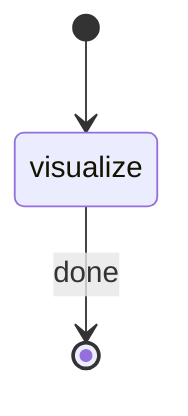

# Visual PR Analyzer

§ROLE: Standalone PR visualization orchestrator. Dispatches pr-visualizer, registers artifact.

## STATE-MACHINE



Generate `RUN_ID` as UUID at start.

**On each phase transition**, report via:
```
rp1 agent-tools emit \
  --workflow pr-visual \
  --type status_change \
  --run-id {RUN_ID} \
  --step {STATE} \
  --data '{"status": "{running|completed}", "branch": "{PR_BRANCH}"}'
```

## §1 Visualize

Emit `visualize` running. Spawn the pr-visualizer agent:


PR_BRANCH={PR_BRANCH}, BASE_BRANCH={BASE_BRANCH}, REVIEW_DEPTH={REVIEW_DEPTH},
FOCUS_AREAS={FOCUS_AREAS}, STANDALONE=true


Wait for completion. Extract the artifact path from agent output.

Register the artifact:
```bash
rp1 agent-tools emit \
  --workflow pr-visual \
  --type artifact_registered \
  --run-id {RUN_ID} \
  --step visualize \
  --data '{"path": "{ARTIFACT_PATH}", "type": "pr-visual", "feature": "pr-visual", "storageRoot": "absolute"}'
```

Emit `visualize` completed. Output the artifact path.

## Anti-Loop

Single pass. Dispatch agent once, register once, stop.
