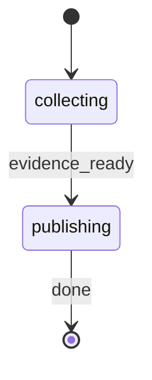

# PR Walkthrough

Generate a Code Tour JSON walkthrough from direct pull request evidence. The output is a reviewer-orientation artifact for the 3D Code Tour reader, not a review verdict.

Use the pre-resolved `projectRoot`, `kbRoot`, `workRoot`, and `codeRoot` values from the generated Workflow Bootstrap section. Run all source-control commands from `codeRoot`, and write generated artifacts only under `workRoot`.

Do not read `.rp1/work/pr-reviews/` or any existing `pr-review` artifacts as source material. The walkthrough source of truth is the target PR metadata, changed files, diffs, and commit summaries gathered in this workflow.

## STATE-MACHINE



**On each phase transition**, report via:
```bash
rp1 agent-tools emit \
  --workflow pr-walkthrough \
  --type status_change \
  --run-id {RUN_ID} \
  --step {CURRENT_STATE} \
  --data '{"status": "running"}'
```

- `RUN_ID` comes from the generated Workflow Bootstrap section.
- Derive `RUN_NAME` from the resolved target: use `"PR Walkthrough: PR #{number}"` when a PR number is available, otherwise `"PR Walkthrough: {branch_name}"`.
- On the first emit only, include `--name "{RUN_NAME}"`.

**Example sequence**:
```bash
rp1 agent-tools emit --workflow pr-walkthrough --type status_change --run-id {RUN_ID} --name "PR Walkthrough: PR #42" --step collecting --data '{"status": "running"}'
rp1 agent-tools emit --workflow pr-walkthrough --type status_change --run-id {RUN_ID} --step publishing --data '{"status": "running"}'
rp1 agent-tools emit --workflow pr-walkthrough --type status_change --run-id {RUN_ID} --step publishing --data '{"status": "completed"}'
```

On a blocking error, emit the current step with `{"status":"failed","reason":"..."}` and stop without dispatching the reporter or registering an artifact.

## 1. Collect Direct Evidence

Execute immediately. Do not ask for clarification. Fail clearly during `collecting` when the target cannot identify one PR or one local diff.

Emit `collecting` running before command execution.

### 1.1 Resolve Target

Normalize inputs:

| Input | Resolution |
|-------|------------|
| Empty `TARGET` | Use the PR associated with the current branch via `gh pr view`; if none exists, use `git diff BASE_BRANCH...current_branch` |
| Numeric target | Use `gh pr view {TARGET}` and `gh pr diff {TARGET}` |
| PR URL | Use `gh pr view {TARGET}` and `gh pr diff {TARGET}` |
| Branch name | Use `gh pr view {TARGET}` if available; otherwise use `git diff BASE_BRANCH...{TARGET}` |

Implementation guidance:

1. Set `target` from `{TARGET}` and `base_branch` from `{BASE_BRANCH}`.
2. Get `current_branch` with `git -C {codeRoot} branch --show-current`.
3. Classify a numeric target with `^[0-9]+$`.
4. Classify a PR URL when the target contains `/pull/`.
5. For empty target or branch target, first try `gh pr view` from `{codeRoot}`. If that fails, validate that both base and head refs exist locally before using the git-only fallback.

If no PR exists and the local fallback cannot produce a diff, fail with a message that includes the attempted target and base branch.

### 1.2 Gather Evidence

For a resolved GitHub PR target, collect:

```bash
gh pr view {resolved_pr_target} \
  --json number,title,body,url,author,baseRefName,headRefName,headRefOid,baseRefOid,additions,deletions,changedFiles,files,commits
gh pr diff {resolved_pr_target} --name-only
gh pr diff {resolved_pr_target} --patch
```

For a git-only target, collect:

```bash
git -C {codeRoot} diff --name-only {base_branch}...{head_ref}
git -C {codeRoot} diff --patch {base_branch}...{head_ref}
git -C {codeRoot} diff --stat {base_branch}...{head_ref}
git -C {codeRoot} log --oneline --no-decorate {base_branch}..{head_ref}
```

For PR targets, attempt a local stat with `git -C {codeRoot} diff --stat {baseRefName}...{headRefName}` when refs exist. If local refs are unavailable, use PR JSON additions, deletions, and changedFiles as the stats source.

Required failure behavior:

- If `gh` is unavailable for a numeric or URL target, fail during `collecting`; do not silently switch to an unrelated local diff.
- If a branch target has no PR and no local diff against `BASE_BRANCH`, fail during `collecting`.
- If the collected changed-file list and patch are both empty, fail during `collecting`.

### 1.3 Build Evidence JSON

Build one `EVIDENCE_JSON` object from direct evidence only:

```json
{
  "source": "github_pr | git_diff",
  "target": "{TARGET}",
  "base_branch": "{base_branch}",
  "head_ref": "{head_ref}",
  "review_id": "{review_id}",
  "pr": {},
  "file_names": [],
  "patch": "",
  "stats": "",
  "commit_summaries": [],
  "evidence_index": []
}
```

Assign evidence IDs before dispatch:

| ID Pattern | Source |
|------------|--------|
| `E-PR-001` | PR metadata, title, body, URL, author, base/head refs, or git-only branch metadata |
| `E-FILE-###` | Changed-file entries from `gh pr diff --name-only`, PR JSON files, or `git diff --name-only` |
| `E-DIFF-###` | Meaningful diff hunks or patch excerpts selected for walkthrough grounding |
| `E-COMMIT-###` | Commit summaries from PR JSON commits or `git log` |

Keep patch data concise enough for the reporter to process, but preserve the file path and hunk headers for every included diff excerpt. The evidence index entries must include `id`, `kind`, `source`, and `summary`.

Derive `review_id` as `pr-{number}` for PR targets. For branch-only targets, sanitize the head ref by lowercasing and replacing characters outside `[a-z0-9._-]` with `-`.

## 2. Generate Walkthrough

After evidence collection succeeds, emit `publishing` running and dispatch the reporter:


Generate one evidence-grounded Code Tour JSON PR walkthrough.
  EVIDENCE_JSON: {{stringify(EVIDENCE_JSON)}}
  KB_ROOT: {kbRoot}
  WORK_ROOT: {workRoot}
  CODE_ROOT: {codeRoot}
  REVIEW_ID: {{review_id}}
  Return single-line JSON with path.


Wait for completion. Parse the reporter output as single-line JSON:

```json
{"path":"pr-walkthroughs/{REVIEW_ID}-walkthrough-{NNN}.json"}
```

If the reporter fails or the output cannot be parsed, emit `publishing` with `{"status":"failed","reason":"reporter failed"}` and stop.

Validate the returned path before registration:

- It must be relative.
- It must start with `pr-walkthroughs/`.
- It must end with `.json`.
- It must not contain `..`.

Do not accept a markdown artifact path, secondary artifact path, or slide-oriented output for new walkthrough runs.

## 3. Register Artifact

Register the reporter output during `publishing`:

```bash
rp1 agent-tools emit \
  --workflow pr-walkthrough \
  --type artifact_registered \
  --run-id {RUN_ID} \
  --step publishing \
  --data '{"path": "{ARTIFACT_RELATIVE_PATH}", "feature": "{review_id}", "storageRoot": "work_dir", "format": "json"}'
```

Then emit `publishing` completed:

```bash
rp1 agent-tools emit \
  --workflow pr-walkthrough \
  --type status_change \
  --run-id {RUN_ID} \
  --step publishing \
  --data '{"status": "completed"}'
```

## Output

Output only:

```markdown
## PR Walkthrough Complete

**Target**: {target_description}
**Artifact**: {ARTIFACT_RELATIVE_PATH}
**Evidence**: {changed_file_count} files, {commit_count} commits
```

## Anti-Loop

Single pass. Do not:

- Ask for clarification or wait for feedback.
- Read existing `pr-review` artifacts.
- Dispatch the reporter more than once.
- Register more than one artifact.
- Accept markdown output, slide-marker output, an alternate artifact path, an extra artifact, or a review verdict.
