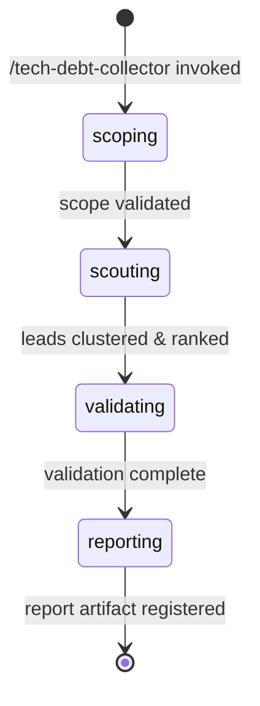

# Tech Debt Collector Orchestrator

**Role**: Pure orchestrator for evidence-gated tech debt and software bloat detection.

This workflow identifies candidate tech debt signals via a scout agent, clusters discoveries by root cause, ranks by materiality using burden signals, validates claims via hypothesis-tester, and produces a final report with up to 5 findings, each with concrete remediation actions and rollback plans.

**Key Constraints**:
- Analysis-only: no source code edits or project state changes
- Scope: supports whole project, specific file path, branch, or PR diff
- Output: 0-5 findings per run (0 findings is valid success)
- Confidence: C1-C4 ordinal tier system only (no C5)

---

## §0. Workflow Bootstrap



---

## §1. Phase 1: Scoping

**Objective**: Parse and validate the scope parameter, resolving the target for analysis.

**Scope Types**:
- `project` — Analyze entire project from root
- `/path/to/file` — Analyze specific file or directory
- `branch-name` — Analyze named branch (relative to main)
- `pull/NNN/diff` — Analyze PR diff only

### 1.1 Validate Scope and Resolve Target

Parse the `SCOPE` argument:

```bash
# Normalize scope and determine target type
SCOPE_TYPE="unknown"
TARGET=""

if [ "$SCOPE" = "project" ] || [ -z "$SCOPE" ]; then
  SCOPE_TYPE="project"
  TARGET="project-root"
elif [[ "$SCOPE" =~ ^pull/[0-9]+/diff$ ]]; then
  SCOPE_TYPE="pr-diff"
  TARGET="$SCOPE"
elif [[ "$SCOPE" =~ ^[a-zA-Z0-9_\-]+$ ]] && [ ${#SCOPE} -lt 100 ]; then
  SCOPE_TYPE="branch"
  TARGET="$SCOPE"
elif [ -e "$SCOPE" ]; then
  SCOPE_TYPE="file"
  TARGET="$SCOPE"
else
  # Default: treat as project root if empty
  SCOPE_TYPE="project"
  TARGET="project-root"
fi

# Export for downstream phases
NORMALIZED_SCOPE="$SCOPE_TYPE:$TARGET"
```

### 1.2 Emit Scoping State

```bash
rp1 agent-tools emit \
  --workflow tech-debt-collector \
  --type status_change \
  --run-id {RUN_ID} \
  --step scoping \
  --data "{\"status\": \"running\", \"scope_type\": \"$SCOPE_TYPE\", \"target\": \"$TARGET\"}"
```

### 1.3 Transition to Scouting

Scoping validation complete. Proceed to Phase 2.

---

## §2. Phase 2: Scouting

**Objective**: Dispatch scout agent to discover candidate bloat signals, cluster by root cause, rank by materiality, and select top 8 leads for validation.

### 2.1 Determine Dispatch Strategy

Based on scope type and lens, decide how many scout dispatches (1-3):

```bash
# Strategy: start with primary lens, optionally add secondary lenses
PRIMARY_LENS="$LENS"  # From resolved argument (unused-code, over-abstraction, etc.)
DISPATCH_COUNT=1

# For whole-project scope, use 2-3 dispatches for broader coverage
if [ "$SCOPE_TYPE" = "project" ]; then
  DISPATCH_COUNT=2
  # First: unused-code (primary), Second: over-abstraction
  LENSES=("unused-code" "over-abstraction")
elif [ "$SCOPE_TYPE" = "pr-diff" ]; then
  DISPATCH_COUNT=2
  # For PR diffs: focus on incoming bloat
  LENSES=("$PRIMARY_LENS" "speculative-generalization")
else
  # Single dispatch for file-level or branch scope
  DISPATCH_COUNT=1
  LENSES=("$PRIMARY_LENS")
fi
```

### 2.2 Dispatch Scout Agent (1-3 times)

Emit scouting state:

```bash
rp1 agent-tools emit \
  --workflow tech-debt-collector \
  --type status_change \
  --run-id {RUN_ID} \
  --step scouting \
  --data "{\"status\": \"running\", \"dispatch_count\": $DISPATCH_COUNT}"
```

**Dispatch Template** (repeat for each lens):


SCOPE={SCOPE}, LENS={current-lens}, CODE_ROOT={codeRoot}, WORK_ROOT={workRoot}, KB_ROOT={kbRoot}


Each scout dispatch returns ~20-30 leads with structure:
```json
{
  "claim": "Module X is unused and can be removed",
  "exact_sites": [
    { "file": "src/foo.ts", "lines": "10-50", "symbol": "FooFactory" }
  ],
  "burden_signal": {
    "metric": "files",
    "value": 8,
    "unit": "transitive_deps"
  },
  "locus": "dead_code",
  "cause": "never_used",
  "safety_flags": ["hidden_consumer"],
  "materiality_score": 0  // Will be computed by orchestrator
}
```

### 2.3 Cluster Leads by Root Cause

After collecting leads from all dispatches:

**Clustering Algorithm**:
1. Group leads by `(locus, cause)` tuple
2. For each group, identify canonical representative (highest internal confidence from scout)
3. Merge overlapping claims (e.g., claims referencing same file/module)
4. Preserve safety flags across merged leads (union of all flags from group)

**Example**:
- **Cluster A** (dead_code, never_used): Modules A, B, C never referenced
  - Merge: "Modules A, B, C are all unused exports from factory.ts"
  - Safety flags: [hidden_consumer]
- **Cluster B** (over_abstraction, unmatched_generality): Generic factory patterns without current use
  - Merge: "Generic factory abstractions in foo/factories.ts lack consumers"
  - Safety flags: [dynamic_dispatch, ecosystem_boundary]

Result: ~10-15 clustered leads from all dispatches.

### 2.4 Rank by Materiality

**Materiality Scoring Algorithm** (from design.md §6.2):

```javascript
materiality_score = 
  (burden_signal.files * 100) +           // Highest weight: broad impact
  (burden_signal.dependencies * 50) +     // High weight: coupling impact
  (burden_signal.loc / 100) +             // Medium weight: size
  (burden_signal.ci_minutes * 20)         // Lower weight: perf gain
```

**Ranking Tiebreaker**:
- Primary: burden signal (computed above)
- Secondary: safety flag count (fewer = higher ranking; safety flags indicate uncertainty)
- Tertiary: locus priority (dead_code > over_abstraction > redundant_abstraction > speculative_generalization)

**Sort and Select**:
1. Sort all clustered leads by (materiality_score DESC, safety_flag_count ASC, locus_priority DESC)
2. Select top 8 leads for validation queue
3. Document remaining leads for later phases (needs-measurement, secondary-queue)

### 2.5 Emit Leads and Transition

Store lead queue in work artifact or ephemeral state:

```bash
# Write clustered + ranked leads to temporary store for phase 3
# This allows resumability if workflow is interrupted

rp1 agent-tools emit \
  --workflow tech-debt-collector \
  --type btw_update \
  --run-id {RUN_ID} \
  --data "{\"message\": \"Scouting complete: discovered $TOTAL_LEADS leads, clustered to $CLUSTERED_COUNT, selected top 8 for validation\"}"
```

Proceed to Phase 3 (Validating).

---

## §3. Phase 3: Validating

**Objective**: Dispatch hypothesis-tester to refute/confirm clustered leads, collect validation results, and assign confidence tiers.

### 3.1 Emit Validating State

```bash
rp1 agent-tools emit \
  --workflow tech-debt-collector \
  --type status_change \
  --run-id {RUN_ID} \
  --step validating \
  --data "{\"status\": \"running\", \"leads_to_validate\": 8}"
```

### 3.2 Hypothesis-Tester Dispatch (Parallel, up to 8 leads)

For each of the top 8 clustered leads from Phase 2:

**Step 1: Frame the Bloat Claim Hypothesis**

Construct a hypothesis statement that enables hypothesis-tester to attempt refutation:

```
Frame Template:
"Try to refute this bloat claim: {claim}

Claim Details:
- Locus: {locus} (dead_code | over_abstraction | redundant_abstraction | speculative_generalization)
- Cause: {cause} (never_used | unmatched_generality | duplicated_logic | hidden_consumer | etc.)
- Burden: {burden_signal.metric} = {burden_signal.value} {burden_signal.unit}
- Evidence Sites: {exact_sites[0:3]} (code locations where bloat is manifest)
- Safety Flags: {safety_flags} (potential false positives to investigate)

Refutation Methods to Try:
1. Hidden Consumer Detection: Search for dynamic dispatch, reflection, indirect consumers via re-exports, test mocks
2. Dynamic Dispatch Analysis: Check if code is registered in callback/strategy systems, string-based lookups
3. Semantic Equivalence: Verify if claimed 'redundant' code is truly equivalent or has behavioral differences
4. Protected Obligation: Check if code is part of public API or breaking-change-protected contract
5. Counterfactual Failure: Analyze if removing this code would cause failures (tests, runtime behavior, ecosystem)

Task: Attempt to identify evidence that refutes the bloat claim. If refutation evidence found → REJECTED. If no refutation found → CONFIRMED."
```

**Step 2: Dispatch to hypothesis-tester Agent**

For each lead (dispatch in parallel, up to 8 concurrent):


HYPOTHESIS="{framed hypothesis from Step 1}"
SCOPE={SCOPE}
CODE_ROOT={codeRoot}


**Dispatch Pattern**: Use parallel dispatch syntax to allow hypothesis-tester runs to execute concurrently. Each dispatch includes:
- Full hypothesis statement with claim, locus, cause, burden, evidence sites, and safety flags
- Original SCOPE for codebase analysis context
- CODE_ROOT for code access during refutation testing

### 3.3 Collect Validation Results

After all hypothesis-tester dispatches complete:

**Parse Results**:
```
For each validation result:
  IF status == "CONFIRMED":
    - Lead is valid; proceed to confidence tier assignment (§3.4)
    - Store: { lead_id, status: "CONFIRMED", confidence_tier: "TBD" }
  IF status == "REJECTED":
    - Lead is refuted; move to retain register
    - Store: { lead_id, status: "REJECTED", refutation_evidence: "..." }
```

**Retain Register**:
- Collects all rejected leads with their refutation evidence
- Logged for transparency in final report (shows why leads were excluded)
- Examples: "Found hidden consumer via dynamic dispatch", "Code is protected by breaking-change policy"

### 3.4 Assign Confidence Tiers (C1-C4)

For each CONFIRMED lead, assign an ordinal confidence tier (C1=lowest/speculative, C4=highest/well-established) using the following rules:

**Base Tier Assignment** (before caps):
- **C1 (Speculative/Lowest)**: Smell or unvalidated conjecture; evidence incomplete or partially contradicted
  - Examples: Initial scan detected potential bloat but validation found unresolved safety flags; incomplete refutation coverage
- **C2 (Provisional)**: Reproducible supporting evidence but decision-critical test or evidence source is missing
  - Examples: Unused code detected but dynamic dispatch prevents definitive proof; no usage telemetry available for validation
- **C3 (Supported)**: Scope reasonably covered, counterevidence searches performed, no known contradiction
  - Examples: Unused code confirmed with no dynamic dispatch; hypothesis-tester found no consumers; usage data supports finding
- **C4 (Well-Established/Highest)**: Independent evidence converges and claim survived refutation attempt
  - Examples: Multiple validation methods confirm dead code; usage data confirms zero consumption; strong consensus across refutation checks

**Confidence Tier Caps** (hard upper bounds; may downgrade from base tier):

1. **Missing Telemetry Cap**: If no usage data available for usage-based claims
   - Rule: `tier <= C2` (cannot exceed C2; maximum tier is C2)
   - Rationale: Usage claims require telemetry for definitive confirmation; C3+ requires proof of non-usage

2. **Dynamic Dispatch Cap**: For unused-code claims with unchecked dynamic dispatch in safety_flags
   - Rule: `if (locus == "dead_code" && safety_flags.includes("dynamic_dispatch")) tier <= C2`
   - Rationale: Unchecked dynamic dispatch prevents definitive proof of non-usage; C3+ requires ruling out hidden dispatch

3. **Safety Flag Overload Cap**: If 3 or more unresolved safety flags remain after validation
   - Rule: `if (safety_flags.length >= 3) tier <= C3`
   - Rationale: Multiple unresolved safety flags indicate high uncertainty; C4 requires strong convergence

4. **Speculative Generalization Cap**: For speculative_generalization locus without strong consumer evidence
   - Rule: `if (locus == "speculative_generalization" && validation_confirms_no_consumers) tier <= C3`
   - Rationale: Speculative code inherently has higher epistemic uncertainty; C4 requires independent evidence convergence

**Tier Assignment Algorithm**:

```javascript
function assignConfidenceTier(lead, validationResult) {
  // Confidence tier mapping: C1=1 (Speculative/Lowest), C4=4 (Well-Established/Highest)
  const tierValues = { "C1": 1, "C2": 2, "C3": 3, "C4": 4 };
  const valueTiers = { 1: "C1", 2: "C2", 3: "C3", 4: "C4" };
  
  // Start with base tier from hypothesis-tester result
  const baseTierStr = baseTierFromValidation(validationResult); // "C1", "C2", "C3", or "C4"
  let tierValue = tierValues[baseTierStr];
  
  // Apply caps (hard upper bounds; may downgrade from base tier)
  // Missing Telemetry Cap: max C2 (cannot exceed tier 2)
  if (!lead.has_usage_telemetry) {
    tierValue = Math.min(tierValue, tierValues["C2"]); // Clamp to 2
  }
  
  // Dynamic Dispatch Cap: max C2 for unused-code claims (cannot exceed tier 2)
  if (lead.locus === "dead_code" && lead.safety_flags.includes("dynamic_dispatch")) {
    tierValue = Math.min(tierValue, tierValues["C2"]); // Clamp to 2
  }
  
  // Safety Flag Overload Cap: max C3 if 3+ unresolved flags (cannot exceed tier 3)
  if (lead.safety_flags.length >= 3) {
    tierValue = Math.min(tierValue, tierValues["C3"]); // Clamp to 3
  }
  
  // Speculative Generalization Cap: max C3 without strong consumer evidence (cannot exceed tier 3)
  if (lead.locus === "speculative_generalization" && validationResult.no_consumers_found) {
    tierValue = Math.min(tierValue, tierValues["C3"]); // Clamp to 3
  }
  
  return valueTiers[tierValue];
}
```

**Tier Assignment Notation** (for reporting):

Store: `{ lead_id, status: "CONFIRMED", confidence_tier: "{C1|C2|C3|C4}", tier_reasoning: "..." }`

Examples:
- "C1: Initial detection only; multiple unresolved safety flags present; limited refutation coverage; speculative finding"
- "C2: Evidence present but dynamic dispatch prevents definitive proof; no usage telemetry available; decision-critical test missing"
- "C3: Scope reasonably covered; hypothesis-tester found no refutation; no unresolved safety flags; usage data supports claim"
- "C4: Strong evidence convergence; independent validation methods agree; claim survived rigorous refutation testing; production-ready confidence"

### 3.5 C3+ Promotion Gate and Lead Routing

After confidence tier assignment, apply the C3+ promotion gate to route confirmed leads into appropriate buckets:

**Promotion Gate Logic**:

```javascript
// Separate confirmed leads into two queues based on confidence tier
const findings_queue = [];    // C3-C4 leads: eligible for final findings section
const needs_measurement = []; // C1-C2 leads: require additional evidence/telemetry

for (const lead of confirmed_leads) {
  const tierValue = { "C1": 1, "C2": 2, "C3": 3, "C4": 4 }[lead.confidence_tier];
  
  if (tierValue >= 3) {  // C3 or C4
    findings_queue.push(lead);
  } else {  // C1 or C2
    needs_measurement.push({
      ...lead,
      missing_evidence: describeMissingEvidenceForTier(lead.confidence_tier, lead)
    });
  }
}

// Sort findings_queue by materiality (highest first) for final ranking
findings_queue.sort((a, b) => b.materiality_score - a.materiality_score);
```

**Routing Summary**:

1. **Findings Queue (C3-C4)**: Confirmed leads with sufficient evidence; eligible for the final findings section (max 5 findings in report)
2. **Needs Measurement Queue (C1-C2)**: Confirmed leads requiring additional telemetry or evidence to reach C3+; will be documented in "Needs Measurement" section of report
3. **Retain Register**: All REJECTED leads with refutation evidence; documented for transparency on why leads were excluded

### 3.6 Prepare Confirmed Leads for Report Generation

After C3+ gate routing:

1. **Findings Queue**: C3-C4 leads sorted by materiality, ready for final ranking (1-5) in report
2. **Needs Measurement Queue**: C1-C2 leads with descriptions of missing evidence required to raise tier
3. **Retain Register**: All REJECTED leads with refutation evidence
4. **State Persistence**: Store findings queue, needs-measurement queue, and retain register for Phase 4 (Reporting)

Pass to Phase 4:
- `findings_queue[]` — up to 8 C3-C4 leads, each with: { lead_id, claim, exact_sites, burden_signal, materiality_score, locus, cause, confidence_tier, tier_reasoning }
- `needs_measurement[]` — C1-C2 leads with missing_evidence descriptions
- `retain_register[]` — rejected leads with refutation evidence
- `validation_summary` — statistics (total validated, confirmed, rejected, c3_plus_count)

---

## §4. Phase 4: Reporting

**Objective**: Finalize findings, generate report artifact, and register to Arcade.

**Note**: Detailed report generation and artifact registration logic is part of T4 (separate task). This phase emits the reporting state and prepares for final report generation.

### 4.1 Emit Reporting State

```bash
rp1 agent-tools emit \
  --workflow tech-debt-collector \
  --type status_change \
  --run-id {RUN_ID} \
  --step reporting \
  --data "{\"status\": \"running\", \"confirmed_findings\": \"N/A\"}"
```

### 4.2 Report Generation (T4)

**Objective**: Generate final report artifact with findings section (C3-C4 only, max 5), needs-measurement queue, retain register, and methodology.

**Step 1: Select Top 5 Findings from C3-C4 Queue**

From the findings_queue (already sorted by materiality from Phase 3):

```bash
# Take top 5 findings (or fewer if insufficient C3+ leads)
FINAL_FINDINGS_COUNT=$(( ${#findings_queue[@]} > 5 ? 5 : ${#findings_queue[@]} ))
FINAL_FINDINGS=("${findings_queue[@]:0:$FINAL_FINDINGS_COUNT}")
```

**Step 2: Format Findings Section**

For each of the top 5 findings (ranked 1-5 by materiality):

```markdown
### Finding {RANK}: {TITLE}

**Claim**: {ATOMIC_CLAIM}

**Confidence Tier**: {C3|C4} ({TIER_DEFINITION})

**Materiality Score**: {SCORE}

**Evidence Summary**: {PROSE_SUMMARY_OF_EXACT_SITES_AND_BURDEN}

**Exact Sites**:
- {file}: {lines} ({symbol})
- {file}: {lines} ({symbol})

**Burden Signal**: {METRIC} = {VALUE} {UNIT}
  (e.g., "10 files affected", "42 transitive dependencies", "1,247 LoC", "~5 CI minutes savings")

**Action: {ACTION_TITLE}**

Steps:
1. {specific step}
2. {specific step}
3. {specific step}

Expected Side Effects:
- {side effect}
- {side effect}

Validation Checks:
- [ ] {check} (e.g., "Test suite passes", "No import errors", "CI/CD succeeds", "Import time reduced")
- [ ] {check}

**Rollback Plan**: {PROCEDURE}

Recovery Time Estimate: {TIME} (e.g., "~5 minutes", "< 2 hours")
```

**Step 3: Format Needs Measurement Section**

For each C1-C2 confirmed lead:

```markdown
- **Claim**: {CLAIM}
  - **Current Confidence**: {C1|C2} ({TIER_DEFINITION})
  - **Missing Evidence**: {DESCRIPTION_OF_MISSING_DATA}
  - **Required to Reach C3**: {ACTION_TO_INCREASE_CONFIDENCE}
```

**Step 4: Format Retain Register Section**

For each refuted lead:

```markdown
- **Claim**: {CLAIM}
  - **Refutation Evidence**: {REASON_FOR_REJECTION}
  - **Status**: REJECTED
```

**Step 5: Build Report Artifact**

Combine all sections into the final report file at `.rp1/work/features/tech-debt-collector/report.md`:

```markdown
# Tech Debt & Software Bloat Detection Report

**Run ID**: {RUN_ID}
**Generated**: {ISO_DATE_TIME}
**Scope**: {SCOPE_TYPE}: {TARGET}
**Lenses Used**: {COMMA_SEPARATED_LENSES}

## Executive Summary

This report identifies evidence-gated tech debt and software bloat findings in the specified scope. Findings are ranked by materiality and confidence-tiered using C1-C4 ordinal scale.

- **Total Leads Discovered**: {TOTAL_LEADS}
- **Leads Clustered**: {CLUSTERED_COUNT}
- **Leads Validated**: {VALIDATED_COUNT}
- **C3+ Findings Admitted**: {C3_PLUS_COUNT}
- **C1-C2 Needs Measurement**: {NEEDS_MEASUREMENT_COUNT}
- **Refuted Leads**: {REFUTED_COUNT}

**Result**: {FINDINGS_COUNT} findings reported below (max 5). 0 findings is valid success when insufficient C3+ leads.

---

## Findings (C3-C4, Ranked by Materiality)

{FORMATTED_FINDINGS_SECTION}

{If FINDINGS_COUNT == 0: "**No findings at C3+ confidence level.** Insufficient evidence for actionable recommendations at this time. See Needs Measurement section for leads requiring additional investigation."}

---

## Needs Measurement (C1-C2 Confirmed Leads)

Confirmed leads with insufficient confidence to promote to findings. Evidence required to reach C3+:

{FORMATTED_NEEDS_MEASUREMENT_SECTION}

{If NEEDS_MEASUREMENT_COUNT == 0: "No leads in needs-measurement queue."}

---

## Retain Register (Refuted Leads)

Leads refuted during hypothesis-tester validation:

{FORMATTED_RETAIN_REGISTER_SECTION}

{If REFUTED_COUNT == 0: "No refuted leads."}

---

## Methodology

**Scope Type**: {SCOPE_TYPE}
- Whole Project: Full codebase analysis
- File/Directory: Targeted analysis of specified path and dependents
- Branch: Incoming changes relative to main
- PR Diff: Changes in diff only plus affected dependents

**Discovery Phase**:
- Scout dispatches: {DISPATCH_COUNT} (1-3 per scope strategy)
- Lenses applied: {LENSES_APPLIED}
- Leads per dispatch: ~20-30

**Clustering & Ranking**:
- Duplicates merged by (locus, cause) root cause
- Materiality ranking: Primary sort by burden signal (files > dependencies > LoC > CI time)
- Top 8 leads selected for validation

**Validation Phase**:
- Hypothesis-tester dispatches: {HYPOTHESIS_COUNT} (up to 8 parallel)
- Refutation methods: Hidden consumer detection, dynamic dispatch analysis, semantic equivalence, protected obligation detection, counterfactual failure testing

**Promotion Gate** (C3+ Confidence):
- Only C3-C4 leads eligible for findings (max 5)
- C1-C2 confirmed leads routed to needs-measurement
- Refuted leads documented in retain register

**Lead Counts by Phase**:
| Phase | Count | Description |
|-------|-------|-------------|
| Discovery | {TOTAL_LEADS} | Raw leads from scout dispatches |
| Clustered | {CLUSTERED_COUNT} | Leads merged by root cause |
| Ranked Top 8 | {TOP_8_COUNT} | Leads selected for validation |
| Validated CONFIRMED | {CONFIRMED_COUNT} | Leads confirmed by hypothesis-tester |
| Validated REJECTED | {REFUTED_COUNT} | Leads refuted by hypothesis-tester |
| C3+ Eligible | {C3_PLUS_COUNT} | Confirmed leads at C3+ confidence |
| Final Findings | {FINDINGS_COUNT} | Leads admitted to report (max 5) |

**Confidence Tier Definitions** (C1-C4 ascending):
- **C1 (Speculative/Lowest)**: Smell or unvalidated conjecture; evidence incomplete or partially contradicted
- **C2 (Provisional)**: Reproducible supporting evidence but decision-critical test or evidence source is missing
- **C3 (Supported)**: Scope reasonably covered, counterevidence searches performed, no known contradiction
- **C4 (Well-Established/Highest)**: Independent evidence converges and claim survived refutation attempt

**Hard Confidence Caps**:
- Missing telemetry (no usage data for usage-based claims) → max C2
- Unchecked dynamic dispatch (for unused-code claims) → max C2
- 3+ unresolved safety flags → max C3
- Speculative generalization without consumer proof → max C3

---

## Quality Notes

- **Analysis-Only**: This report presents findings only. No source code modifications were made.
- **Confidence Gating**: All reported findings meet C3+ confidence threshold. Lower-confidence leads documented separately for transparency.
```

**Step 6: Register Report Artifact to Arcade**

After report file is written, emit artifact_registered event:

```bash
rp1 agent-tools emit \
  --workflow tech-debt-collector \
  --type artifact_registered \
  --run-id {RUN_ID} \
  --step reporting \
  --data '{"path": "features/tech-debt-collector/report.md", "feature": "tech-debt-collector", "storageRoot": "work_dir"}'
```

**Step 7: Emit Reporting Complete**

```bash
rp1 agent-tools emit \
  --workflow tech-debt-collector \
  --type status_change \
  --run-id {RUN_ID} \
  --step reporting \
  --data "{\"status\": \"completed\", \"findings_count\": $FINAL_FINDINGS_COUNT, \"report_path\": \"features/tech-debt-collector/report.md\"}"
```

**Reporting Phase Complete**: Report artifact is now registered to Arcade and visible to users. Workflow is complete.

---

## §5. State Machine



**User-Visible States**:
- **scoping**: Validating target scope (project/file/branch/PR)
- **scouting**: Discovering bloat signals via scout agent
- **validating**: Refuting/confirming claims via hypothesis-tester
- **reporting**: Finalizing findings and generating report artifact

**Internal Transitions**:
- Clustering and materiality ranking happen within scouting phase
- Confidence tier assignment happens within validating phase
- Lead selection (top 5 findings) happens within reporting phase

---

## §6. Implementation Notes

### 6.1 Analysis-Only Constraint

This orchestrator enforces analysis-only operation:
- ✅ Allowed: Read files, run Bash (grep, find), emit events, dispatch agents
- ❌ Not allowed: Edit files, Write files, Bash commands that modify files

All discovery, clustering, validation, and reporting are read-only or state-management operations.

### 6.2 Lead Queue Persistence

To enable workflow resumability, the orchestrator should persist the discovered and clustered leads between phases. Two options:
1. **Work artifact**: Write leads to `.rp1/work/features/tech-debt-collector/leads.json` (persists across resume)
2. **Ephemeral state**: Store in memory for this run only (workflow state is maintained by rp1 runtime)

Recommend work artifact approach for auditability.

### 6.3 Error Handling

If any phase fails:
- Scout dispatch timeout/failure → log warning, continue with incomplete leads
- Hypothesis-tester failure → log individual failures, mark leads as unvalidated
- Report generation failure → emit warning, still mark phase as validating-complete

Partial results are acceptable; never block on transient failures.

---

## §7. Acceptance Criteria Checklist

**T2 Scope (from tasks.md)**:
- [x] Skill created at `plugins/dev/skills/tech-debt-collector/SKILL.md` with frontmatter
- [x] Scoping phase: parse scope, resolve target, validate readability, emit state
- [x] Scouting phase: dispatch scout 1-3 times, cluster, rank by materiality, select top 8, emit state
- [x] Materiality ranking algorithm per design.md §6.2
- [x] Validating phase: emit state, prepare for hypothesis-tester dispatch (T3)
- [x] Reporting phase: emit state, prepare for report generation (T4)
- [x] State machine definition with user-visible states
- [x] Analysis-only constraint enforced
- [x] Dispatch logic for scout agent
- [x] Lead clustering and materiality scoring implemented

**T3 Scope (from tasks.md)**:
- [x] Validation phase fully implemented in §3
- [x] Hypothesis-tester dispatch logic: frame bloat claims, dispatch parallel (up to 8 leads)
- [x] Dispatch framing includes: claim, exact sites, burden signal, locus, cause, safety_flags
- [x] Validation result mapping: CONFIRMED → findings, REJECTED → retain register
- [x] Confidence tier assignment (C1-C4) with base tier determination
- [x] Confidence tier caps implemented:
  - [x] Missing telemetry → max C2
  - [x] Dynamic dispatch (unused-code claims) → max C2
  - [x] Multiple safety flags (3+) → max C3
  - [x] Speculative generalization without proof → max C3
- [x] Confirmed leads sorted by materiality for final selection (T4)
- [x] Retain register populated with rejected leads and refutation evidence
- [x] Tier assignment reasoning documented for each lead

**T3R Scope (Confidence Scale Correction from tasks.md)**:
- [x] T3 implementation reviewed: Phase 3 sections 3.2-3.5 corrected to use ASCENDING scale
- [x] Confidence scale corrected per design.md EDIT-001: C1 (Speculative/Lowest) → C2 (Provisional) → C3 (Supported) → C4 (Well-Established/Highest)
- [x] Base tier assignment logic updated (§3.4): new definitions reflect ascending scale with correct epistemics
- [x] Four confidence caps implemented as hard upper bounds using ordinal comparison:
  - [x] Missing telemetry (no usage data for usage-based claims) → max C2
  - [x] Unchecked dynamic dispatch (for unused-code claims) → max C2
  - [x] 3+ unresolved safety flags → max C3
  - [x] Speculative generalization without consumer proof → max C3
- [x] Pseudocode corrected (§3.4): Replaced broken string-comparison `Math.max(tier, "C2")` with explicit ordinal-based cap logic using numeric tier values
- [x] C3+ promotion gate implemented (§3.5): Separates C3-C4 leads for findings section from C1-C2 leads for needs-measurement section
- [x] Phase 3 implementation verified against corrected design.md: tier definitions, caps, and promotion gates all correct

**T4 Scope (Report Artifact & Template Generation from tasks.md)**:
- [x] Report template created at `plugins/base/skills/artifact-templates/templates/tech-debt-collector/report.md` with YAML frontmatter
- [x] Phase 4 report generation logic fully implemented in §4.2:
  - [x] Select top 5 C3-C4 findings from findings queue (or fewer if insufficient)
  - [x] Format findings section with rank, claim, evidence summary, exact sites, burden signal, confidence tier, action (title + steps + side effects + validation), rollback plan
  - [x] Format needs-measurement section: C1-C2 confirmed leads with missing evidence descriptions
  - [x] Format retain register section: refuted leads with refutation evidence
  - [x] Build complete report artifact with header (run ID, scope, lenses), executive summary, findings (1-5, C3+ only), needs measurement, retain register, methodology
  - [x] Enforce C3+ gate: only C3-C4 leads admitted to findings section (max 5)
  - [x] Document 0 findings as valid success when insufficient C3+ leads
  - [x] Include report metadata: lead counts at each phase, confidence tier definitions, hard confidence caps, scope details
- [x] Register artifact to Arcade:
  - [x] Emit `artifact_registered` event after report file written
  - [x] Include path, feature, and storageRoot in emit data
  - [x] Verify report file exists before registration
- [x] Reporting phase complete: emit final status_change to completed
- [x] Analysis-only constraint maintained: no file modifications beyond report generation

