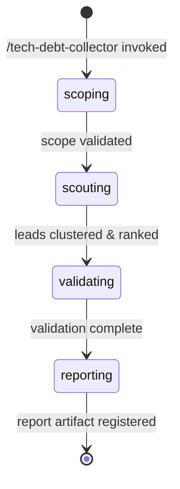

# Tech Debt Collector Orchestrator

**Role**: Pure orchestrator for evidence-gated tech debt and software bloat detection.

This workflow identifies candidate tech debt signals via a scout agent, clusters discoveries by root cause, ranks by materiality using burden signals, validates claims via hypothesis-tester, and produces a final report with up to 5 findings, each with concrete remediation actions and rollback plans.

**Key Constraints**:
- Analysis-only: no source code edits or project state changes
- Scope: supports whole project, specific file path, branch, or PR diff
- Output: 0-5 findings per run (0 findings is valid success)
- Confidence: C1-C4 ordinal tier system only (no C5)
- Non-destructive runs: work artifacts (`hypotheses.md`, `leads.json`, `report.md`) live at fixed paths under `features/tech-debt-collector/`; at run start any prior versions are archived into `features/tech-debt-collector/runs/<prior-run-id>/` (§1.4) before the new run writes, so completed runs remain retrievable

---

§CTX: Use the pre-resolved `SCOPE`, `LENS`, `RUN_ID`, `projectRoot`, `kbRoot`, `workRoot`, and `codeRoot` values from the generated Workflow Bootstrap section. Do not hardcode `.rp1/work/` or `.rp1/context/` paths.

## References

| File | Purpose | When to Load |
|------|---------|--------------|
| `references/validation-scoring.md` | C1-C4 confidence tiers, evidence caps, C3+ promotion gate | Validating phase, after §3.3 collects hypothesis-tester results |
| `references/report-format.md` | Finding template, section ordering, artifact registration | Reporting phase, after §4.1 emits the reporting state |
| `references/run-archival.md` | Archiving a prior run's artifacts | Scoping phase, only when prior-run artifacts exist |
| `references/scope-resolution.md` | SCOPE classification order, PR-reference forms, cross-repository guard | Scoping phase, at §1.1 |
| `references/lead-processing.md` | Root-cause clustering and materiality ranking | Scouting phase, once the scout returns leads |

---

## §1. Phase 1: Scoping

**Objective**: Parse and validate the scope parameter, resolving the target for analysis.

**Scope Types**:
- `project` — Analyze entire project from root
- `/path/to/file` — Analyze specific file or directory
- `branch-name` — Analyze named branch (relative to main)
- `pull/NNN/diff` — Analyze PR diff only

### 1.1 Validate Scope and Resolve Target

Read `references/scope-resolution.md` and follow it to set `SCOPE_TYPE` and `TARGET`. It carries the classification order, accepted PR-reference forms, and the cross-repository guard.

### 1.2 Pin the Analyzed Snapshot (Base/Head SHAs)

Resolve immutable `BASE_COMMIT`/`HEAD_COMMIT` SHAs NOW — before any scout runs — so the report identifies the exact snapshot the analysis observed. PR and branch refs are mutable; capturing them after analysis (or only at reporting) can attribute findings to commits that were never analyzed. §4.2 re-verifies these values at reporting time and fails closed if the refs moved mid-run.

```bash
case "$SCOPE_TYPE" in
  pr-diff)
    BASE_COMMIT=$(gh pr view "$TARGET" --json baseRefOid --jq '.baseRefOid')
    HEAD_COMMIT=$(gh pr view "$TARGET" --json headRefOid --jq '.headRefOid')
    ;;
  branch)
    BASE_COMMIT=$(git merge-base main "$TARGET")
    HEAD_COMMIT=$(git rev-parse "$TARGET")
    ;;
  project|file)
    BASE_COMMIT="N/A"
    HEAD_COMMIT=$(git rev-parse HEAD)
    ;;
esac
```

This is read-only VCS metadata capture, permitted under §6.1.

### 1.3 Emit Scoping State

```bash
rp1 agent-tools emit \
  --workflow tech-debt-collector \
  --type status_change \
  --run-id {RUN_ID} \
  --step scoping \
  --data "{\"status\": \"running\", \"scope_type\": \"$SCOPE_TYPE\", \"target\": \"$TARGET\", \"base_commit\": \"$BASE_COMMIT\", \"head_commit\": \"$HEAD_COMMIT\"}"
```

### 1.4 Archive Prior Run Artifacts

If a prior run left artifacts for this scope, read `references/run-archival.md` and follow it. Otherwise continue to §1.5.

### 1.5 Transition to Scouting

Scoping validation and archival complete. Proceed to Phase 2.

---

## §2. Phase 2: Scouting

**Objective**: Dispatch scout agent to discover candidate bloat signals, cluster by root cause, rank by materiality, and select top 8 leads for validation.

### 2.1 Determine Dispatch Strategy

Based on scope type and lens, decide how many scout dispatches (1-3):

```bash
# Strategy: start with primary lens, optionally add secondary lenses
PRIMARY_LENS="$LENS"  # From resolved argument (unused-code, over-abstraction, etc.)
DISPATCH_COUNT=1

# For whole-project scope, use 2-3 dispatches for broader coverage
if [ "$SCOPE_TYPE" = "project" ]; then
  DISPATCH_COUNT=2
  # First: unused-code (primary), Second: over-abstraction
  LENSES=("unused-code" "over-abstraction")
elif [ "$SCOPE_TYPE" = "pr-diff" ]; then
  DISPATCH_COUNT=2
  # For PR diffs: focus on incoming bloat
  LENSES=("$PRIMARY_LENS" "speculative-generalization")
else
  # Single dispatch for file-level or branch scope
  DISPATCH_COUNT=1
  LENSES=("$PRIMARY_LENS")
fi
```

### 2.2 Dispatch Scout Agent (1-3 times)

Emit scouting state:

```bash
rp1 agent-tools emit \
  --workflow tech-debt-collector \
  --type status_change \
  --run-id {RUN_ID} \
  --step scouting \
  --data "{\"status\": \"running\", \"dispatch_count\": $DISPATCH_COUNT}"
```

**Dispatch Template** (repeat for each lens; scope is pre-resolved in §1.1 — scouts never re-classify):


SCOPE_TYPE={SCOPE_TYPE}, TARGET={TARGET}, LENS={current-lens}, CODE_ROOT={codeRoot}, KB_ROOT={kbRoot}


Each scout dispatch returns ~20-30 leads with structure:
```json
{
  "claim": "Module X is unused and can be removed",
  "exact_sites": [
    { "file": "src/foo.ts", "lines": "10-50", "symbol": "FooFactory" }
  ],
  "burden_signal": {
    "metric": "files",
    "value": 8,
    "unit": "transitive_deps"
  },
  "locus": "dead_code",
  "cause": "never_used",
  "safety_flags": ["hidden_consumer"],
  "usage_evidence": "static-partial",
  "materiality_score": 0  // Will be computed by orchestrator
}
```

### 2.3 Cluster and Rank Leads

Read `references/lead-processing.md` and follow it. It carries root-cause clustering and the materiality ranking signals.

### 2.5 Emit Leads and Transition

Store lead queue in work artifact or ephemeral state:

```bash
# Write clustered + ranked leads to temporary store for phase 3
# This allows resumability if workflow is interrupted

rp1 agent-tools emit \
  --workflow tech-debt-collector \
  --type btw_update \
  --run-id {RUN_ID} \
  --data "{\"message\": \"Scouting complete: discovered $TOTAL_LEADS leads, clustered to $CLUSTERED_COUNT, selected top 8 for validation\"}"
```

Proceed to Phase 3 (Validating).

---

## §3. Phase 3: Validating

**Objective**: Dispatch hypothesis-tester to refute/confirm clustered leads, collect validation results, and assign confidence tiers.

### 3.1 Emit Validating State

```bash
rp1 agent-tools emit \
  --workflow tech-debt-collector \
  --type status_change \
  --run-id {RUN_ID} \
  --step validating \
  --data "{\"status\": \"running\", \"leads_to_validate\": 8}"
```

### 3.2 Hypothesis-Tester Dispatch (single dispatch, up to 8 leads)

`hypothesis-tester` is document-driven: it requires `FEATURE_ID`, `KB_ROOT`, and `WORK_ROOT`, and validates the PENDING hypotheses in an existing `hypotheses.md`. Satisfy that contract by materializing the admitted leads as a hypothesis document, then dispatching once.

**Step 1: Write the Hypothesis Document**

Write `{workRoot}/features/tech-debt-collector/hypotheses.md` following the canonical template at `plugins/base/skills/artifact-templates/templates/hypothesis-tester/hypothesis-document.md` (fall back to the `rp1-base:artifact-templates` SKILL.md index if the direct path fails). This file is owned by this workflow and overwritten on each run. One entry per admitted lead, IDs `HYP-TD-001` … `HYP-TD-008`:

```markdown
### HYP-TD-{NNN}: {short title derived from claim}
**Risk Level**: {HIGH if safety_flags non-empty, else MEDIUM}
**Status**: PENDING
**Statement**: {atomic bloat claim, verbatim from lead}
**Context**: Locus: {locus} | Cause: {cause} | Burden: {burden_signal.metric}={burden_signal.value} {burden_signal.unit} | Sites: {exact_sites[0:3]} | Safety flags: {safety_flags} | Usage evidence: {usage_evidence}
**Validation Criteria**:
- CONFIRM if: all refutation attempts fail — no hidden consumers (dynamic dispatch, reflection, re-exports, test mocks), no protected API or backward-compatibility obligation, no semantic difference for redundancy claims, no counterfactual failure from removal
- REJECT if: any refuting evidence is found (a consumer, a protected obligation, a semantic difference, or a failure mode triggered by removal)
**Suggested Method**: CODEBASE_ANALYSIS
```

**Step 2: Dispatch hypothesis-tester (full declared contract)**


FEATURE_ID=tech-debt-collector, KB_ROOT={kbRoot}, WORK_ROOT={workRoot}, CODE_ROOT={codeRoot}, WORKFLOW=tech-debt-collector, RUN_ID={RUN_ID}


The tester validates every PENDING hypothesis in the document (parallelizing independent ones internally), appends findings under `## Validation Findings`, and updates each Status to CONFIRMED or REJECTED.

### 3.3 Collect Validation Results

After the dispatch completes, read back `{workRoot}/features/tech-debt-collector/hypotheses.md` and map each `HYP-TD-{NNN}` result to its lead:

```
For each hypothesis result:
  IF Result == "CONFIRMED":   # claim survived refutation
    - Lead is valid; proceed to confidence tier assignment (§3.4)
    - Parse `refutation_coverage` from the findings' `Refutation Coverage` field (`complete`|`minor-gaps`|`partial`|`contradicted`) and `unresolved_safety_flags` from the `Safety Flags Unresolved` field (list; empty when "None")
    - Store: { lead_id, status: "CONFIRMED", confidence_tier: "TBD", validation_result: { refutation_coverage, unresolved_safety_flags }, evidence: {recorded findings} }
  IF Result == "REJECTED":    # refuting evidence found
    - Lead is refuted; move to retain register
    - Store: { lead_id, status: "REJECTED", refutation_evidence: {recorded findings} }
```

If the tester returns a `rejected_hypotheses` JSON block, it enumerates the refuted leads. No user gate applies in this workflow — rejection simply routes those leads to the retain register.

**Retain Register**:
- Collects all rejected leads with their refutation evidence
- Logged for transparency in final report (shows why leads were excluded)
- Examples: "Found hidden consumer via dynamic dispatch", "Code is protected by breaking-change policy"

### 3.4 Assign Confidence Tiers and Route Leads

Read `references/validation-scoring.md` and apply it to the collected results. It carries the C1-C4 tier rules, the evidence caps, and the C3+ promotion gate.

### 3.6 Prepare Confirmed Leads for Report Generation

After C3+ gate routing:

1. **Findings Queue**: C3-C4 leads sorted by materiality, ready for final ranking (1-5) in report
2. **Needs Measurement Queue**: C1-C2 leads with descriptions of missing evidence required to raise tier
3. **Retain Register**: All REJECTED leads with refutation evidence
4. **State Persistence**: Store findings queue, needs-measurement queue, and retain register for Phase 4 (Reporting)

Pass to Phase 4:
- `findings_queue[]` — up to 8 C3-C4 leads, each with: { lead_id, claim, exact_sites, burden_signal, materiality_score, locus, cause, confidence_tier, tier_reasoning }
- `needs_measurement[]` — C1-C2 leads with missing_evidence descriptions
- `retain_register[]` — rejected leads with refutation evidence
- `validation_summary` — statistics (total validated, confirmed, rejected, c3_plus_count)

---

## §4. Phase 4: Reporting

**Objective**: Finalize findings, generate report artifact, and register to Arcade.

### 4.1 Emit Reporting State

```bash
rp1 agent-tools emit \
  --workflow tech-debt-collector \
  --type status_change \
  --run-id {RUN_ID} \
  --step reporting \
  --data "{\"status\": \"running\", \"confirmed_findings\": \"N/A\"}"
```

### 4.2 Report Generation

Read `references/report-format.md` and follow it to produce the artifact. It carries the finding template, section ordering, and artifact registration.

**Reporting Phase Complete**: Report artifact is written and registered to Arcade (if successful). Workflow transitions to completed state.

## STATE-MACHINE



**User-Visible States**:
- **scoping**: Validating target scope (project/file/branch/PR)
- **scouting**: Discovering bloat signals via scout agent
- **validating**: Refuting/confirming claims via hypothesis-tester
- **reporting**: Finalizing findings and generating report artifact

**Internal Transitions**:
- Clustering and materiality ranking happen within scouting phase
- Confidence tier assignment happens within validating phase
- Lead selection (top 5 findings) happens within reporting phase

---

## §6. Implementation Notes

### 6.1 Analysis-Only Constraint

This orchestrator never inspects or modifies source code:
- ✅ Allowed: dispatch agents, emit events, read work artifacts and canonical templates, write work artifacts under `{workRoot}/features/tech-debt-collector/` only (`leads.json`, `hypotheses.md`, `report.md`), read-only VCS metadata capture (`gh pr view`, `git merge-base`, `git rev-parse`) for snapshot pinning and report reproducibility (§1.2, §4.2), `mkdir`+`mv` archival of prior-run artifacts confined to `{workRoot}/features/tech-debt-collector/runs/` at run start (§1.4) for non-destructive runs
- ❌ Not allowed: reading source files, editing or writing anything outside that work directory, Bash commands that modify files or mutate VCS state (e.g. `git checkout`, `git merge`, `git commit`, `git push`)

Source-level discovery and validation happen exclusively inside bloat-scout and hypothesis-tester dispatches; the orchestrator handles only structured lead data, which protects the main context window.

### 6.2 Lead Queue Persistence

To enable workflow resumability, the orchestrator should persist the discovered and clustered leads between phases. Two options:
1. **Work artifact**: Write leads to `.rp1/work/features/tech-debt-collector/leads.json` (persists across resume)
2. **Ephemeral state**: Store in memory for this run only (workflow state is maintained by rp1 runtime)

Recommend work artifact approach for auditability.

### 6.3 Error Handling

If any phase fails:
- Scout dispatch timeout/failure → log warning, continue with incomplete leads
- Hypothesis-tester failure → log individual failures, mark leads as unvalidated
- Report generation failure → emit warning, still mark phase as validating-complete

Partial results are acceptable; never block on transient failures.
