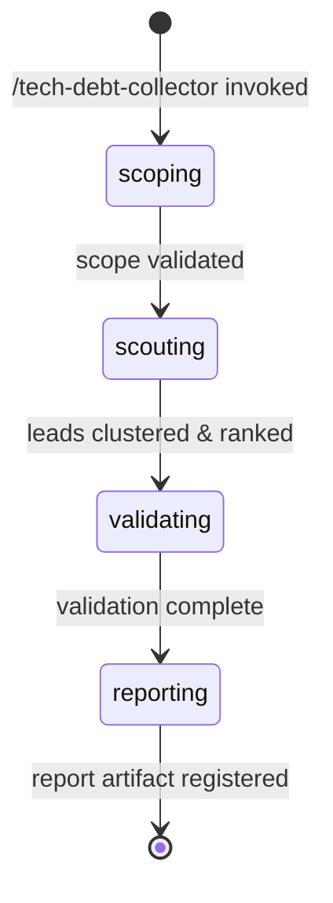

# Tech Debt Collector Orchestrator

**Role**: Pure orchestrator for evidence-gated tech debt and software bloat detection.

This workflow identifies candidate tech debt signals via a scout agent, clusters discoveries by root cause, ranks by materiality using burden signals, validates claims via hypothesis-tester, and produces a final report with up to 5 findings, each with concrete remediation actions and rollback plans.

**Key Constraints**:
- Analysis-only: no source code edits or project state changes
- Scope: supports whole project, specific file path, branch, or PR diff
- Output: 0-5 findings per run (0 findings is valid success)
- Confidence: C1-C4 ordinal tier system only (no C5)

---

## §0. Workflow Bootstrap



---

## §1. Phase 1: Scoping

**Objective**: Parse and validate the scope parameter, resolving the target for analysis.

**Scope Types**:
- `project` — Analyze entire project from root
- `/path/to/file` — Analyze specific file or directory
- `branch-name` — Analyze named branch (relative to main)
- `pull/NNN/diff` — Analyze PR diff only

### 1.1 Validate Scope and Resolve Target

Parse the `SCOPE` argument:

```bash
# Normalize scope and determine target type
SCOPE_TYPE="unknown"
TARGET=""

if [ "$SCOPE" = "project" ] || [ -z "$SCOPE" ]; then
  SCOPE_TYPE="project"
  TARGET="project-root"
elif [[ "$SCOPE" =~ ^pull/[0-9]+/diff$ ]]; then
  SCOPE_TYPE="pr-diff"
  TARGET="$SCOPE"
elif [[ "$SCOPE" =~ ^[a-zA-Z0-9_\-]+$ ]] && [ ${#SCOPE} -lt 100 ]; then
  SCOPE_TYPE="branch"
  TARGET="$SCOPE"
elif [ -e "$SCOPE" ]; then
  SCOPE_TYPE="file"
  TARGET="$SCOPE"
else
  # Default: treat as project root if empty
  SCOPE_TYPE="project"
  TARGET="project-root"
fi

# Export for downstream phases
NORMALIZED_SCOPE="$SCOPE_TYPE:$TARGET"
```

### 1.2 Emit Scoping State

```bash
rp1 agent-tools emit \
  --workflow tech-debt-collector \
  --type status_change \
  --run-id {RUN_ID} \
  --step scoping \
  --data "{\"status\": \"running\", \"scope_type\": \"$SCOPE_TYPE\", \"target\": \"$TARGET\"}"
```

### 1.3 Transition to Scouting

Scoping validation complete. Proceed to Phase 2.

---

## §2. Phase 2: Scouting

**Objective**: Dispatch scout agent to discover candidate bloat signals, cluster by root cause, rank by materiality, and select top 8 leads for validation.

### 2.1 Determine Dispatch Strategy

Based on scope type and lens, decide how many scout dispatches (1-3):

```bash
# Strategy: start with primary lens, optionally add secondary lenses
PRIMARY_LENS="$LENS"  # From resolved argument (unused-code, over-abstraction, etc.)
DISPATCH_COUNT=1

# For whole-project scope, use 2-3 dispatches for broader coverage
if [ "$SCOPE_TYPE" = "project" ]; then
  DISPATCH_COUNT=2
  # First: unused-code (primary), Second: over-abstraction
  LENSES=("unused-code" "over-abstraction")
elif [ "$SCOPE_TYPE" = "pr-diff" ]; then
  DISPATCH_COUNT=2
  # For PR diffs: focus on incoming bloat
  LENSES=("$PRIMARY_LENS" "speculative-generalization")
else
  # Single dispatch for file-level or branch scope
  DISPATCH_COUNT=1
  LENSES=("$PRIMARY_LENS")
fi
```

### 2.2 Dispatch Scout Agent (1-3 times)

Emit scouting state:

```bash
rp1 agent-tools emit \
  --workflow tech-debt-collector \
  --type status_change \
  --run-id {RUN_ID} \
  --step scouting \
  --data "{\"status\": \"running\", \"dispatch_count\": $DISPATCH_COUNT}"
```

**Dispatch Template** (repeat for each lens):


SCOPE={SCOPE}, LENS={current-lens}, CODE_ROOT={codeRoot}, WORK_ROOT={workRoot}, KB_ROOT={kbRoot}


Each scout dispatch returns ~20-30 leads with structure:
```json
{
  "claim": "Module X is unused and can be removed",
  "exact_sites": [
    { "file": "src/foo.ts", "lines": "10-50", "symbol": "FooFactory" }
  ],
  "burden_signal": {
    "metric": "files",
    "value": 8,
    "unit": "transitive_deps"
  },
  "locus": "dead_code",
  "cause": "never_used",
  "safety_flags": ["hidden_consumer"],
  "materiality_score": 0  // Will be computed by orchestrator
}
```

### 2.3 Cluster Leads by Root Cause

After collecting leads from all dispatches:

**Clustering Algorithm**:
1. Group leads by `(locus, cause)` tuple
2. For each group, identify canonical representative (highest internal confidence from scout)
3. Merge overlapping claims (e.g., claims referencing same file/module)
4. Preserve safety flags across merged leads (union of all flags from group)

**Example**:
- **Cluster A** (dead_code, never_used): Modules A, B, C never referenced
  - Merge: "Modules A, B, C are all unused exports from factory.ts"
  - Safety flags: [hidden_consumer]
- **Cluster B** (over_abstraction, unmatched_generality): Generic factory patterns without current use
  - Merge: "Generic factory abstractions in foo/factories.ts lack consumers"
  - Safety flags: [dynamic_dispatch, ecosystem_boundary]

Result: ~10-15 clustered leads from all dispatches.

### 2.4 Rank by Materiality

**Materiality Scoring Algorithm** (from design.md §6.2):

```javascript
materiality_score = 
  (burden_signal.files * 100) +           // Highest weight: broad impact
  (burden_signal.dependencies * 50) +     // High weight: coupling impact
  (burden_signal.loc / 100) +             // Medium weight: size
  (burden_signal.ci_minutes * 20)         // Lower weight: perf gain
```

**Ranking Tiebreaker**:
- Primary: burden signal (computed above)
- Secondary: safety flag count (fewer = higher ranking; safety flags indicate uncertainty)
- Tertiary: locus priority (dead_code > over_abstraction > redundant_abstraction > speculative_generalization)

**Sort and Select**:
1. Sort all clustered leads by (materiality_score DESC, safety_flag_count ASC, locus_priority DESC)
2. Select top 8 leads for validation queue
3. Document remaining leads for later phases (needs-measurement, secondary-queue)

### 2.5 Emit Leads and Transition

Store lead queue in work artifact or ephemeral state:

```bash
# Write clustered + ranked leads to temporary store for phase 3
# This allows resumability if workflow is interrupted

rp1 agent-tools emit \
  --workflow tech-debt-collector \
  --type btw_update \
  --run-id {RUN_ID} \
  --data "{\"message\": \"Scouting complete: discovered $TOTAL_LEADS leads, clustered to $CLUSTERED_COUNT, selected top 8 for validation\"}"
```

Proceed to Phase 3 (Validating).

---

## §3. Phase 3: Validating

**Objective**: Dispatch hypothesis-tester to refute/confirm clustered leads, collect validation results, and assign confidence tiers.

### 3.1 Emit Validating State

```bash
rp1 agent-tools emit \
  --workflow tech-debt-collector \
  --type status_change \
  --run-id {RUN_ID} \
  --step validating \
  --data "{\"status\": \"running\", \"leads_to_validate\": 8}"
```

### 3.2 Hypothesis-Tester Dispatch (Parallel, up to 8 leads)

For each of the top 8 clustered leads from Phase 2:

**Step 1: Frame the Bloat Claim Hypothesis**

Construct a hypothesis statement that enables hypothesis-tester to attempt refutation:

```
Frame Template:
"Try to refute this bloat claim: {claim}

Claim Details:
- Locus: {locus} (dead_code | over_abstraction | redundant_abstraction | speculative_generalization)
- Cause: {cause} (never_used | unmatched_generality | duplicated_logic | hidden_consumer | etc.)
- Burden: {burden_signal.metric} = {burden_signal.value} {burden_signal.unit}
- Evidence Sites: {exact_sites[0:3]} (code locations where bloat is manifest)
- Safety Flags: {safety_flags} (potential false positives to investigate)

Refutation Methods to Try:
1. Hidden Consumer Detection: Search for dynamic dispatch, reflection, indirect consumers via re-exports, test mocks
2. Dynamic Dispatch Analysis: Check if code is registered in callback/strategy systems, string-based lookups
3. Semantic Equivalence: Verify if claimed 'redundant' code is truly equivalent or has behavioral differences
4. Protected Obligation: Check if code is part of public API or breaking-change-protected contract
5. Counterfactual Failure: Analyze if removing this code would cause failures (tests, runtime behavior, ecosystem)

Task: Attempt to identify evidence that refutes the bloat claim. If refutation evidence found → REJECTED. If no refutation found → CONFIRMED."
```

**Step 2: Dispatch to hypothesis-tester Agent**

For each lead (dispatch in parallel, up to 8 concurrent):


HYPOTHESIS="{framed hypothesis from Step 1}"
SCOPE={SCOPE}
CODE_ROOT={codeRoot}


**Dispatch Pattern**: Use parallel dispatch syntax to allow hypothesis-tester runs to execute concurrently. Each dispatch includes:
- Full hypothesis statement with claim, locus, cause, burden, evidence sites, and safety flags
- Original SCOPE for codebase analysis context
- CODE_ROOT for code access during refutation testing

### 3.3 Collect Validation Results

After all hypothesis-tester dispatches complete:

**Parse Results**:
```
For each validation result:
  IF status == "CONFIRMED":
    - Lead is valid; proceed to confidence tier assignment (§3.4)
    - Store: { lead_id, status: "CONFIRMED", confidence_tier: "TBD" }
  IF status == "REJECTED":
    - Lead is refuted; move to retain register
    - Store: { lead_id, status: "REJECTED", refutation_evidence: "..." }
```

**Retain Register**:
- Collects all rejected leads with their refutation evidence
- Logged for transparency in final report (shows why leads were excluded)
- Examples: "Found hidden consumer via dynamic dispatch", "Code is protected by breaking-change policy"

### 3.4 Assign Confidence Tiers (C1-C4)

For each CONFIRMED lead, assign an ordinal confidence tier (C1=highest, C4=lowest) using the following rules:

**Base Tier Assignment** (before caps):
- **C1 (Highest)**: All evidence present, no methodology gaps, strong validation by hypothesis-tester
  - Examples: Unused code with no dynamic dispatch detected, confirmed by hypothesis-tester, usage data available
- **C2**: Evidence sufficient but with known gaps
  - Examples: Unused code but dynamic dispatch present (verified but not fully confirmable); or no usage tracking available
- **C3**: Moderate evidence gaps, partial validation coverage
  - Examples: Speculative generalization with some consumer evidence but incomplete proof; multiple safety flags partially investigated
- **C4 (Lowest)**: High uncertainty, many unresolved safety flags
  - Examples: Over-abstraction claim with multiple hidden-consumer flags and incomplete refutation evidence

**Confidence Tier Caps** (hard limits, may downgrade from base tier):

1. **Missing Telemetry Cap**: If no usage data available for usage-based claims
   - Rule: `max_tier = C2` (cannot be C1, even with strong validation)
   - Rationale: Usage claims require telemetry for definitive confirmation

2. **Dynamic Dispatch Cap**: For unused-code claims with unchecked dynamic dispatch in safety_flags
   - Rule: `if (locus == "dead_code" && safety_flags.includes("dynamic_dispatch")) max_tier = C2`
   - Rationale: Dynamic dispatch prevents definitive proof of non-usage

3. **Safety Flag Overload Cap**: If 3 or more unresolved safety flags remain after validation
   - Rule: `if (safety_flags.length >= 3) max_tier = C3`
   - Rationale: Multiple unresolved safety flags indicate high uncertainty

4. **Speculative Generalization Cap**: For speculative_generalization locus without strong consumer evidence
   - Rule: `if (locus == "speculative_generalization" && validation_confirms_no_consumers) max_tier = C3`
   - Rationale: Future-focused code inherently has higher epistemic uncertainty

**Tier Assignment Algorithm**:

```javascript
function assignConfidenceTier(lead, validationResult) {
  // Start with base tier from hypothesis-tester result
  let tier = baseTierFromValidation(validationResult); // C1, C2, C3, or C4
  
  // Apply caps (may downgrade)
  if (!lead.has_usage_telemetry) {
    tier = Math.max(tier, "C2"); // Cap at C2 if no telemetry
  }
  
  if (lead.locus === "dead_code" && lead.safety_flags.includes("dynamic_dispatch")) {
    tier = Math.max(tier, "C2"); // Cap at C2 for dynamic dispatch in dead_code
  }
  
  if (lead.safety_flags.length >= 3) {
    tier = Math.max(tier, "C3"); // Cap at C3 if 3+ safety flags
  }
  
  if (lead.locus === "speculative_generalization" && validationResult.no_consumers_found) {
    tier = Math.max(tier, "C3"); // Cap at C3 for unconfirmed speculative code
  }
  
  return tier;
}
```

**Tier Assignment Notation** (for reporting):

Store: `{ lead_id, status: "CONFIRMED", confidence_tier: "{C1|C2|C3|C4}", tier_reasoning: "..." }`

Examples:
- "C1: All evidence present, no gaps, hypothesis-tester found no refutation, usage data available"
- "C2: Evidence sufficient but dynamic dispatch present (capped from C1); hypothesis-tester confirmed no consumer via static analysis"
- "C3: Moderate gaps; multiple safety flags partially investigated; speculative generalization without full proof"
- "C4: High uncertainty; multiple unresolved safety flags; incomplete refutation evidence"

### 3.5 Prepare Confirmed Leads for Report Generation

After validation and confidence tier assignment:

1. **Confirmed Leads List**: All CONFIRMED leads with assigned confidence tiers (C1-C4), sorted by materiality score (highest first)
2. **Retain Register**: All REJECTED leads with refutation evidence
3. **State Persistence**: Store confirmed leads and retain register for Phase 4 (Reporting)

Pass to Phase 4:
- `confirmed_leads[]` — up to 8 leads, each with: { lead_id, claim, exact_sites, burden_signal, materiality_score, locus, cause, confidence_tier, tier_reasoning }
- `retain_register[]` — rejected leads with refutation evidence
- `validation_summary` — statistics (total validated, confirmed, rejected, high-confidence count)

---

## §4. Phase 4: Reporting

**Objective**: Finalize findings, generate report artifact, and register to Arcade.

**Note**: Detailed report generation and artifact registration logic is part of T4 (separate task). This phase emits the reporting state and prepares for final report generation.

### 4.1 Emit Reporting State

```bash
rp1 agent-tools emit \
  --workflow tech-debt-collector \
  --type status_change \
  --run-id {RUN_ID} \
  --step reporting \
  --data "{\"status\": \"running\", \"confirmed_findings\": \"N/A\"}"
```

### 4.2 Prepare for Report Generation (T4)

In task T4, the orchestrator will:
1. Select top 5 confirmed findings (or fewer if fewer confirmed)
2. For each finding, ensure concrete action and rollback plan
3. Sort by materiality score (highest first)
4. Generate report artifact at `.rp1/work/features/tech-debt-collector/report.md`:
   - Header with summary (run ID, scope, lenses used, lead counts at each phase)
   - Findings section (1-5 findings, ranked)
   - Retain Register section (refuted leads with refutation evidence)
   - Needs Measurement section (leads requiring additional telemetry)
   - Methodology section (detailed breakdown of discovery → clustering → validation → promotion pipeline)
5. Register artifact to Arcade:
   ```bash
   rp1 agent-tools emit \
     --workflow tech-debt-collector \
     --type artifact_registered \
     --run-id {RUN_ID} \
     --step reporting \
     --data '{"path": "features/tech-debt-collector/report.md", "feature": "tech-debt-collector", "storageRoot": "work_dir"}'
   ```

---

## §5. State Machine



**User-Visible States**:
- **scoping**: Validating target scope (project/file/branch/PR)
- **scouting**: Discovering bloat signals via scout agent
- **validating**: Refuting/confirming claims via hypothesis-tester
- **reporting**: Finalizing findings and generating report artifact

**Internal Transitions**:
- Clustering and materiality ranking happen within scouting phase
- Confidence tier assignment happens within validating phase
- Lead selection (top 5 findings) happens within reporting phase

---

## §6. Implementation Notes

### 6.1 Analysis-Only Constraint

This orchestrator enforces analysis-only operation:
- ✅ Allowed: Read files, run Bash (grep, find), emit events, dispatch agents
- ❌ Not allowed: Edit files, Write files, Bash commands that modify files

All discovery, clustering, validation, and reporting are read-only or state-management operations.

### 6.2 Lead Queue Persistence

To enable workflow resumability, the orchestrator should persist the discovered and clustered leads between phases. Two options:
1. **Work artifact**: Write leads to `.rp1/work/features/tech-debt-collector/leads.json` (persists across resume)
2. **Ephemeral state**: Store in memory for this run only (workflow state is maintained by rp1 runtime)

Recommend work artifact approach for auditability.

### 6.3 Error Handling

If any phase fails:
- Scout dispatch timeout/failure → log warning, continue with incomplete leads
- Hypothesis-tester failure → log individual failures, mark leads as unvalidated
- Report generation failure → emit warning, still mark phase as validating-complete

Partial results are acceptable; never block on transient failures.

---

## §7. Acceptance Criteria Checklist

**T2 Scope (from tasks.md)**:
- [x] Skill created at `plugins/dev/skills/tech-debt-collector/SKILL.md` with frontmatter
- [x] Scoping phase: parse scope, resolve target, validate readability, emit state
- [x] Scouting phase: dispatch scout 1-3 times, cluster, rank by materiality, select top 8, emit state
- [x] Materiality ranking algorithm per design.md §6.2
- [x] Validating phase: emit state, prepare for hypothesis-tester dispatch (T3)
- [x] Reporting phase: emit state, prepare for report generation (T4)
- [x] State machine definition with user-visible states
- [x] Analysis-only constraint enforced
- [x] Dispatch logic for scout agent
- [x] Lead clustering and materiality scoring implemented

**T3 Scope (from tasks.md)**:
- [x] Validation phase fully implemented in §3
- [x] Hypothesis-tester dispatch logic: frame bloat claims, dispatch parallel (up to 8 leads)
- [x] Dispatch framing includes: claim, exact sites, burden signal, locus, cause, safety_flags
- [x] Validation result mapping: CONFIRMED → findings, REJECTED → retain register
- [x] Confidence tier assignment (C1-C4) with base tier determination
- [x] Confidence tier caps implemented:
  - [x] Missing telemetry → max C2
  - [x] Dynamic dispatch (unused-code claims) → max C2
  - [x] Multiple safety flags (3+) → max C3
  - [x] Speculative generalization without proof → max C3
- [x] Confirmed leads sorted by materiality for final selection (T4)
- [x] Retain register populated with rejected leads and refutation evidence
- [x] Tier assignment reasoning documented for each lead

