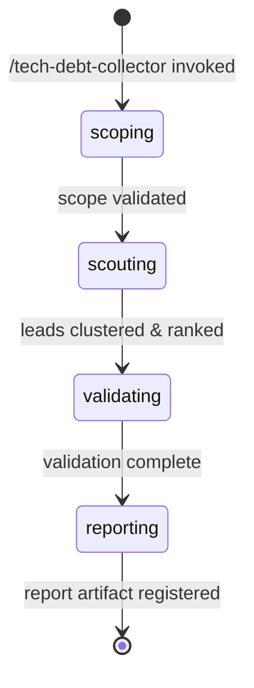

# Tech Debt Collector Orchestrator

**Role**: Pure orchestrator for evidence-gated tech debt and software bloat detection.

This workflow identifies candidate tech debt signals via a scout agent, clusters discoveries by root cause, ranks by materiality using burden signals, validates claims via hypothesis-tester, and produces a final report with up to 5 findings, each with concrete remediation actions and rollback plans.

**Key Constraints**:
- Analysis-only: no source code edits or project state changes
- Scope: supports whole project, specific file path, branch, or PR diff
- Output: 0-5 findings per run (0 findings is valid success)
- Confidence: C1-C4 ordinal tier system only (no C5)
- Single active run: work artifacts (`hypotheses.md`, `leads.json`, `report.md`) live at fixed paths under `features/tech-debt-collector/` and are overwritten by each run — copy the report elsewhere before starting another scope

---

§CTX: Use the pre-resolved `SCOPE`, `LENS`, `RUN_ID`, `projectRoot`, `kbRoot`, `workRoot`, and `codeRoot` values from the generated Workflow Bootstrap section. Do not hardcode `.rp1/work/` or `.rp1/context/` paths.

---

## §1. Phase 1: Scoping

**Objective**: Parse and validate the scope parameter, resolving the target for analysis.

**Scope Types**:
- `project` — Analyze entire project from root
- `/path/to/file` — Analyze specific file or directory
- `branch-name` — Analyze named branch (relative to main)
- `pull/NNN/diff` — Analyze PR diff only

### 1.1 Validate Scope and Resolve Target

Classify the `SCOPE` argument in this exact order — explicit project, PR reference, filesystem path, verified git ref — and fail closed on anything else. A token that is both a path and a branch resolves as a path; use `pull/<N>/diff` or a path-free branch name to disambiguate. PR references accept the short forms (`pull/<N>/diff`, `PR #<N>`), a full GitHub PR URL, and that URL's bare path form (without scheme/host, e.g. `owner/repo/pull/<N>`) — all four resolve to the same bare `TARGET` PR number; scouts resolve the diff via the GitHub CLI (`gh`), which must be available and authenticated.

```bash
SCOPE_TYPE=""
TARGET=""

if [ -z "$SCOPE" ] || [ "$SCOPE" = "project" ]; then
  SCOPE_TYPE="project"
  TARGET="{codeRoot}"
elif [[ "$SCOPE" =~ ^pull/([0-9]+)/diff$ ]] || \
     [[ "$SCOPE" =~ ^PR[[:space:]]?#?([0-9]+)$ ]] || \
     [[ "$SCOPE" =~ ^https://github\.com/[^/[:space:]]+/[^/[:space:]]+/pull/([0-9]+)/?$ ]] || \
     [[ "$SCOPE" =~ ^[^/[:space:]]+/[^/[:space:]]+/pull/([0-9]+)/?$ ]]; then
  SCOPE_TYPE="pr-diff"
  TARGET="${BASH_REMATCH[1]}"   # bare PR number, e.g. 433
elif [ -e "$SCOPE" ]; then
  SCOPE_TYPE="file"
  TARGET="$SCOPE"
elif git rev-parse --verify --quiet "$SCOPE^{commit}" >/dev/null 2>&1; then
  SCOPE_TYPE="branch"
  TARGET="$SCOPE"
else
  echo "ERROR: SCOPE '$SCOPE' is not 'project', an existing path, a resolvable git branch/ref, or a PR reference. Use the canonical form 'PR #<N>' (pull/<N>/diff, a full GitHub PR URL, and its bare owner/repo/pull/<N> path form are also accepted)."
fi
```

If classification fails, emit `scoping` with `{"status": "failed", "reason": "unresolvable_scope"}` and STOP. Never silently default an unknown target to project scope.

**Canonical Scope Form** (REQ-003): `PR #<N>` is this workflow's canonical, identity-stable PR scope form. `SCOPE` is also this workflow's declared `identity_args` value, hashed verbatim by the shared workflow-identity mechanism — so `pull/<N>/diff`, the full URL, and the bare path form still produce a different run identity than `PR #<N>` even though all four resolve to the same `TARGET`. Canonicalizing identity itself would require changing the shared identity-hashing mechanism every rp1 workflow depends on, which is disproportionate to this fix; documenting one canonical form and steering the fail-closed error message toward it keeps the change scoped to this skill. Operators who need run-identity continuity across repeated invocations against the same PR should always invoke with `PR #<N>`.

### 1.2 Emit Scoping State

```bash
rp1 agent-tools emit \
  --workflow tech-debt-collector \
  --type status_change \
  --run-id {RUN_ID} \
  --step scoping \
  --data "{\"status\": \"running\", \"scope_type\": \"$SCOPE_TYPE\", \"target\": \"$TARGET\"}"
```

### 1.3 Transition to Scouting

Scoping validation complete. Proceed to Phase 2.

---

## §2. Phase 2: Scouting

**Objective**: Dispatch scout agent to discover candidate bloat signals, cluster by root cause, rank by materiality, and select top 8 leads for validation.

### 2.1 Determine Dispatch Strategy

Based on scope type and lens, decide how many scout dispatches (1-3):

```bash
# Strategy: start with primary lens, optionally add secondary lenses
PRIMARY_LENS="$LENS"  # From resolved argument (unused-code, over-abstraction, etc.)
DISPATCH_COUNT=1

# For whole-project scope, use 2-3 dispatches for broader coverage
if [ "$SCOPE_TYPE" = "project" ]; then
  DISPATCH_COUNT=2
  # First: unused-code (primary), Second: over-abstraction
  LENSES=("unused-code" "over-abstraction")
elif [ "$SCOPE_TYPE" = "pr-diff" ]; then
  DISPATCH_COUNT=2
  # For PR diffs: focus on incoming bloat
  LENSES=("$PRIMARY_LENS" "speculative-generalization")
else
  # Single dispatch for file-level or branch scope
  DISPATCH_COUNT=1
  LENSES=("$PRIMARY_LENS")
fi
```

### 2.2 Dispatch Scout Agent (1-3 times)

Emit scouting state:

```bash
rp1 agent-tools emit \
  --workflow tech-debt-collector \
  --type status_change \
  --run-id {RUN_ID} \
  --step scouting \
  --data "{\"status\": \"running\", \"dispatch_count\": $DISPATCH_COUNT}"
```

**Dispatch Template** (repeat for each lens; scope is pre-resolved in §1.1 — scouts never re-classify):


SCOPE_TYPE={SCOPE_TYPE}, TARGET={TARGET}, LENS={current-lens}, CODE_ROOT={codeRoot}, KB_ROOT={kbRoot}


Each scout dispatch returns ~20-30 leads with structure:
```json
{
  "claim": "Module X is unused and can be removed",
  "exact_sites": [
    { "file": "src/foo.ts", "lines": "10-50", "symbol": "FooFactory" }
  ],
  "burden_signal": {
    "metric": "files",
    "value": 8,
    "unit": "transitive_deps"
  },
  "locus": "dead_code",
  "cause": "never_used",
  "safety_flags": ["hidden_consumer"],
  "usage_evidence": "static-partial",
  "materiality_score": 0  // Will be computed by orchestrator
}
```

### 2.3 Cluster Leads by Root Cause

After collecting leads from all dispatches:

**Clustering Algorithm**:
1. For each lead, derive `module` = the directory portion (all path segments except the filename) of `exact_sites[0].file` — the lead's primary exact site
2. Group leads by `(locus, cause, module)` tuple — locus/cause alone is not sufficient; leads whose primary sites live in unrelated modules never merge, even with matching locus/cause
3. For each group, identify canonical representative (highest internal confidence from scout) — unchanged
4. Merge overlapping claims within a group (e.g., claims referencing the same file/module) — unchanged
5. Preserve safety flags across merged leads (union of all flags from group) — unchanged

**Example**:
- **Cluster A** (dead_code, never_used, `src/legacy/factory`): Modules A, B, C never referenced
  - Merge: "Modules A, B, C are all unused exports from `src/legacy/factory/factory.ts`"
  - Safety flags: [hidden_consumer]
- **Cluster B** (dead_code, never_used, `src/billing/adapters`): unrelated dead-code lead sharing the same `(locus, cause)` as Cluster A but a different module
  - Stays separate from Cluster A despite the matching locus/cause, because its primary exact site is in `src/billing/adapters`
- **Cluster C** (over_abstraction, unmatched_generality, `src/foo`): Generic factory patterns without current use
  - Merge: "Generic factory abstractions in `src/foo/factories.ts` lack consumers"
  - Safety flags: [dynamic_dispatch, ecosystem_boundary]

Result: ~10-15 clustered leads from all dispatches.

### 2.4 Rank by Materiality

**Materiality Scoring Algorithm**: each lead carries exactly one `burden_signal {metric, value, unit}`. Score it against the documented per-metric weight — never against fields the schema does not carry:

```javascript
WEIGHT = { files: 100, dependencies: 50, loc: 0.01, ci_minutes: 20 };
materiality_score = burden_signal.value * WEIGHT[burden_signal.metric];
```

**Ranking Tiebreaker**:
- Primary: burden signal (computed above)
- Secondary: safety flag count (fewer = higher ranking; safety flags indicate uncertainty)
- Tertiary: locus priority (dead_code > over_abstraction > redundant_abstraction > speculative_generalization)

**Sort and Select**:
1. Sort all clustered leads by (materiality_score DESC, safety_flag_count ASC, locus_priority DESC)
2. Select top 8 leads for validation queue
3. Document remaining leads for later phases (needs-measurement, secondary-queue)

### 2.5 Emit Leads and Transition

Store lead queue in work artifact or ephemeral state:

```bash
# Write clustered + ranked leads to temporary store for phase 3
# This allows resumability if workflow is interrupted

rp1 agent-tools emit \
  --workflow tech-debt-collector \
  --type btw_update \
  --run-id {RUN_ID} \
  --data "{\"message\": \"Scouting complete: discovered $TOTAL_LEADS leads, clustered to $CLUSTERED_COUNT, selected top 8 for validation\"}"
```

Proceed to Phase 3 (Validating).

---

## §3. Phase 3: Validating

**Objective**: Dispatch hypothesis-tester to refute/confirm clustered leads, collect validation results, and assign confidence tiers.

### 3.1 Emit Validating State

```bash
rp1 agent-tools emit \
  --workflow tech-debt-collector \
  --type status_change \
  --run-id {RUN_ID} \
  --step validating \
  --data "{\"status\": \"running\", \"leads_to_validate\": 8}"
```

### 3.2 Hypothesis-Tester Dispatch (single dispatch, up to 8 leads)

`hypothesis-tester` is document-driven: it requires `FEATURE_ID`, `KB_ROOT`, and `WORK_ROOT`, and validates the PENDING hypotheses in an existing `hypotheses.md`. Satisfy that contract by materializing the admitted leads as a hypothesis document, then dispatching once.

**Step 1: Write the Hypothesis Document**

Write `{workRoot}/features/tech-debt-collector/hypotheses.md` following the canonical template at `plugins/base/skills/artifact-templates/templates/hypothesis-tester/hypothesis-document.md` (fall back to the `rp1-base:artifact-templates` SKILL.md index if the direct path fails). This file is owned by this workflow and overwritten on each run. One entry per admitted lead, IDs `HYP-TD-001` … `HYP-TD-008`:

```markdown
### HYP-TD-{NNN}: {short title derived from claim}
**Risk Level**: {HIGH if safety_flags non-empty, else MEDIUM}
**Status**: PENDING
**Statement**: {atomic bloat claim, verbatim from lead}
**Context**: Locus: {locus} | Cause: {cause} | Burden: {burden_signal.metric}={burden_signal.value} {burden_signal.unit} | Sites: {exact_sites[0:3]} | Safety flags: {safety_flags} | Usage evidence: {usage_evidence}
**Validation Criteria**:
- CONFIRM if: all refutation attempts fail — no hidden consumers (dynamic dispatch, reflection, re-exports, test mocks), no protected API or backward-compatibility obligation, no semantic difference for redundancy claims, no counterfactual failure from removal
- REJECT if: any refuting evidence is found (a consumer, a protected obligation, a semantic difference, or a failure mode triggered by removal)
**Suggested Method**: CODEBASE_ANALYSIS
```

**Step 2: Dispatch hypothesis-tester (full declared contract)**


FEATURE_ID=tech-debt-collector, KB_ROOT={kbRoot}, WORK_ROOT={workRoot}, CODE_ROOT={codeRoot}, WORKFLOW=tech-debt-collector, RUN_ID={RUN_ID}


The tester validates every PENDING hypothesis in the document (parallelizing independent ones internally), appends findings under `## Validation Findings`, and updates each Status to CONFIRMED or REJECTED.

### 3.3 Collect Validation Results

After the dispatch completes, read back `{workRoot}/features/tech-debt-collector/hypotheses.md` and map each `HYP-TD-{NNN}` result to its lead:

```
For each hypothesis result:
  IF Result == "CONFIRMED":   # claim survived refutation
    - Lead is valid; proceed to confidence tier assignment (§3.4)
    - Store: { lead_id, status: "CONFIRMED", confidence_tier: "TBD", evidence: {recorded findings} }
  IF Result == "REJECTED":    # refuting evidence found
    - Lead is refuted; move to retain register
    - Store: { lead_id, status: "REJECTED", refutation_evidence: {recorded findings} }
```

If the tester returns a `rejected_hypotheses` JSON block, it enumerates the refuted leads. No user gate applies in this workflow — rejection simply routes those leads to the retain register.

**Retain Register**:
- Collects all rejected leads with their refutation evidence
- Logged for transparency in final report (shows why leads were excluded)
- Examples: "Found hidden consumer via dynamic dispatch", "Code is protected by breaking-change policy"

### 3.4 Assign Confidence Tiers (C1-C4)

For each CONFIRMED lead, assign an ordinal confidence tier (C1=lowest/speculative, C4=highest/well-established) using the following rules:

**Base Tier Assignment** (before caps):
- **C1 (Speculative/Lowest)**: Smell or unvalidated conjecture; evidence incomplete or partially contradicted
  - Examples: Initial scan detected potential bloat but validation found unresolved safety flags; incomplete refutation coverage
- **C2 (Provisional)**: Reproducible supporting evidence but decision-critical test or evidence source is missing
  - Examples: Unused code detected but dynamic dispatch prevents definitive proof; no usage telemetry available for validation
- **C3 (Supported)**: Scope reasonably covered, counterevidence searches performed, no known contradiction
  - Examples: Unused code confirmed with no dynamic dispatch; hypothesis-tester found no consumers; usage data supports finding
- **C4 (Well-Established/Highest)**: Independent evidence converges and claim survived refutation attempt
  - Examples: Multiple validation methods confirm dead code; usage data confirms zero consumption; strong consensus across refutation checks

**Confidence Tier Caps** (hard upper bounds; may downgrade from base tier):

1. **Missing Usage-Proof Cap**: Usage-based claims (locus `dead_code` or cause `never_used`) require proof of non-usage for C3+
   - Rule: `tier <= C2` unless `usage_evidence` is `runtime-telemetry`, or is `static-complete` with none of the `hidden_consumer`/`dynamic_dispatch`/`ecosystem_boundary` safety flags
   - Rationale: C3+ requires proof of non-usage — either runtime telemetry or an exhaustive static reference search with dynamic patterns ruled out

2. **Dynamic Dispatch Cap**: For unused-code claims with unchecked dynamic dispatch in safety_flags
   - Rule: `if (locus == "dead_code" && safety_flags.includes("dynamic_dispatch")) tier <= C2`
   - Rationale: Unchecked dynamic dispatch prevents definitive proof of non-usage; C3+ requires ruling out hidden dispatch

3. **Safety Flag Overload Cap**: If 3 or more unresolved safety flags remain after validation
   - Rule: `if (safety_flags.length >= 3) tier <= C3`
   - Rationale: Multiple unresolved safety flags indicate high uncertainty; C4 requires strong convergence

4. **Speculative Generalization Cap**: For speculative_generalization locus without strong consumer evidence
   - Rule: `if (locus == "speculative_generalization" && validation_confirms_no_consumers) tier <= C3`
   - Rationale: Speculative code inherently has higher epistemic uncertainty; C4 requires independent evidence convergence

**Tier Assignment Algorithm**:

```javascript
function assignConfidenceTier(lead, validationResult) {
  // Confidence tier mapping: C1=1 (Speculative/Lowest), C4=4 (Well-Established/Highest)
  const tierValues = { "C1": 1, "C2": 2, "C3": 3, "C4": 4 };
  const valueTiers = { 1: "C1", 2: "C2", 3: "C3", 4: "C4" };

  // Start with base tier from hypothesis-tester result
  const baseTierStr = baseTierFromValidation(validationResult); // "C1", "C2", "C3", or "C4"
  let tierValue = tierValues[baseTierStr];

  // Apply caps (hard upper bounds; may downgrade from base tier)
  // Missing Usage-Proof Cap: usage-based claims need telemetry or complete static proof for C3+
  const usageBased = lead.locus === "dead_code" || lead.cause === "never_used";
  const staticProof = lead.usage_evidence === "static-complete" &&
    !lead.safety_flags.some(f => ["hidden_consumer", "dynamic_dispatch", "ecosystem_boundary"].includes(f));
  if (usageBased && lead.usage_evidence !== "runtime-telemetry" && !staticProof) {
    tierValue = Math.min(tierValue, tierValues["C2"]); // Clamp to 2
  }

  // Dynamic Dispatch Cap: max C2 for unused-code claims (cannot exceed tier 2)
  if (lead.locus === "dead_code" && lead.safety_flags.includes("dynamic_dispatch")) {
    tierValue = Math.min(tierValue, tierValues["C2"]); // Clamp to 2
  }

  // Safety Flag Overload Cap: max C3 if 3+ unresolved flags (cannot exceed tier 3)
  if (lead.safety_flags.length >= 3) {
    tierValue = Math.min(tierValue, tierValues["C3"]); // Clamp to 3
  }

  // Speculative Generalization Cap: max C3 without strong consumer evidence (cannot exceed tier 3)
  if (lead.locus === "speculative_generalization" && validationResult.no_consumers_found) {
    tierValue = Math.min(tierValue, tierValues["C3"]); // Clamp to 3
  }

  return valueTiers[tierValue];
}
```

**Tier Assignment Notation** (for reporting):

Store: `{ lead_id, status: "CONFIRMED", confidence_tier: "{C1|C2|C3|C4}", tier_reasoning: "..." }`

Examples:
- "C1: Initial detection only; multiple unresolved safety flags present; limited refutation coverage; speculative finding"
- "C2: Evidence present but dynamic dispatch prevents definitive proof; no usage telemetry available; decision-critical test missing"
- "C3: Scope reasonably covered; hypothesis-tester found no refutation; no unresolved safety flags; usage data supports claim"
- "C4: Strong evidence convergence; independent validation methods agree; claim survived rigorous refutation testing; production-ready confidence"

### 3.5 C3+ Promotion Gate and Lead Routing

After confidence tier assignment, apply the C3+ promotion gate to route confirmed leads into appropriate buckets:

**Promotion Gate Logic**:

```javascript
// Separate confirmed leads into two queues based on confidence tier
const findings_queue = [];    // C3-C4 leads: eligible for final findings section
const needs_measurement = []; // C1-C2 leads: require additional evidence/telemetry

for (const lead of confirmed_leads) {
  const tierValue = { "C1": 1, "C2": 2, "C3": 3, "C4": 4 }[lead.confidence_tier];

  if (tierValue >= 3) {  // C3 or C4
    findings_queue.push(lead);
  } else {  // C1 or C2
    needs_measurement.push({
      ...lead,
      missing_evidence: describeMissingEvidenceForTier(lead.confidence_tier, lead)
    });
  }
}

// Sort findings_queue by materiality (highest first) for final ranking
findings_queue.sort((a, b) => b.materiality_score - a.materiality_score);
```

**Routing Summary**:

1. **Findings Queue (C3-C4)**: Confirmed leads with sufficient evidence; eligible for the final findings section (max 5 findings in report)
2. **Needs Measurement Queue (C1-C2)**: Confirmed leads requiring additional telemetry or evidence to reach C3+; will be documented in "Needs Measurement" section of report
3. **Retain Register**: All REJECTED leads with refutation evidence; documented for transparency on why leads were excluded

### 3.6 Prepare Confirmed Leads for Report Generation

After C3+ gate routing:

1. **Findings Queue**: C3-C4 leads sorted by materiality, ready for final ranking (1-5) in report
2. **Needs Measurement Queue**: C1-C2 leads with descriptions of missing evidence required to raise tier
3. **Retain Register**: All REJECTED leads with refutation evidence
4. **State Persistence**: Store findings queue, needs-measurement queue, and retain register for Phase 4 (Reporting)

Pass to Phase 4:
- `findings_queue[]` — up to 8 C3-C4 leads, each with: { lead_id, claim, exact_sites, burden_signal, materiality_score, locus, cause, confidence_tier, tier_reasoning }
- `needs_measurement[]` — C1-C2 leads with missing_evidence descriptions
- `retain_register[]` — rejected leads with refutation evidence
- `validation_summary` — statistics (total validated, confirmed, rejected, c3_plus_count)

---

## §4. Phase 4: Reporting

**Objective**: Finalize findings, generate report artifact, and register to Arcade.

### 4.1 Emit Reporting State

```bash
rp1 agent-tools emit \
  --workflow tech-debt-collector \
  --type status_change \
  --run-id {RUN_ID} \
  --step reporting \
  --data "{\"status\": \"running\", \"confirmed_findings\": \"N/A\"}"
```

### 4.2 Report Generation

**Objective**: Generate the final report artifact with findings section (C3-C4 only, max 5), needs-measurement queue, retain register, and methodology.

**Step 1: Capture Base/Head Commit SHAs**

Compute `BASE_COMMIT` and `HEAD_COMMIT` for the report header from the `SCOPE_TYPE`/`TARGET` resolved in §1.1, using only tooling already declared in `allowed-tools`:

```bash
case "$SCOPE_TYPE" in
  pr-diff)
    BASE_COMMIT=$(gh pr view "$TARGET" --json baseRefOid --jq '.baseRefOid')
    HEAD_COMMIT=$(gh pr view "$TARGET" --json headRefOid --jq '.headRefOid')
    ;;
  branch)
    BASE_COMMIT=$(git merge-base main "$TARGET")
    HEAD_COMMIT=$(git rev-parse "$TARGET")
    ;;
  project|file)
    BASE_COMMIT="N/A"
    HEAD_COMMIT=$(git rev-parse HEAD)
    ;;
esac
```

This is read-only VCS metadata capture, permitted under §6.1.

**Step 2: Select Top 5 Findings from C3-C4 Queue**

From the findings_queue (already sorted by materiality from Phase 3):

```bash
# Take top 5 findings (or fewer if insufficient C3+ leads)
FINAL_FINDINGS_COUNT=$(( ${#findings_queue[@]} > 5 ? 5 : ${#findings_queue[@]} ))
FINAL_FINDINGS=("${findings_queue[@]:0:$FINAL_FINDINGS_COUNT}")
```

**Step 3: Read the Canonical Template**

Read `plugins/base/skills/artifact-templates/templates/tech-debt-collector/report.md` (fall back to the `rp1-base:artifact-templates` SKILL.md Template Index if the direct path fails). The template body is the single source of truth for report structure — do not invent a parallel skeleton.

**Step 4: Fill Template Placeholders**

Fill `{RUN_ID}`, `{Date}`, `{SCOPE_TYPE}`, `{TARGET}`, `{BASE_COMMIT}`, `{HEAD_COMMIT}`, `{LENSES_USED}`, `{LENSES_APPLIED}`, `{DISPATCH_COUNT}`, `{HYPOTHESIS_COUNT}`, and all lead-count placeholders from Phase 2/3 state. Fill the three section placeholders as follows.

`{FINDINGS_SECTION}` — for each of the top 5 findings (ranked 1-5 by materiality):

```markdown
### Finding {RANK}: {TITLE}

**Claim**: {ATOMIC_CLAIM}

**Confidence Tier**: {C3|C4} ({TIER_DEFINITION})

**Materiality Score**: {SCORE}

**Evidence Summary**: {PROSE_SUMMARY_OF_EXACT_SITES_AND_BURDEN}

**Exact Sites**:
- {file}: {lines} ({symbol})
- {file}: {lines} ({symbol})

**Burden Signal**: {METRIC} = {VALUE} {UNIT}
  (e.g., "10 files affected", "42 transitive dependencies", "1,247 LoC", "~5 CI minutes savings")

**Action: {ACTION_TITLE}**

Steps:
1. {specific step}
2. {specific step}
3. {specific step}

Expected Side Effects:
- {side effect}
- {side effect}

Validation Checks:
- [ ] {check} (e.g., "Test suite passes", "No import errors", "CI/CD succeeds", "Import time reduced")
- [ ] {check}

**Rollback Plan**: {PROCEDURE}

Recovery Time Estimate: {TIME} (e.g., "~5 minutes", "< 2 hours")
```

If `FINDINGS_COUNT == 0`, fill with: "**No findings at C3+ confidence level.** Insufficient evidence for actionable recommendations at this time. See Needs Measurement section for leads requiring additional investigation."

`{NEEDS_MEASUREMENT_SECTION}` — for each C1-C2 confirmed lead (or "No leads in needs-measurement queue." when empty):

```markdown
- **Claim**: {CLAIM}
  - **Current Confidence**: {C1|C2} ({TIER_DEFINITION})
  - **Missing Evidence**: {DESCRIPTION_OF_MISSING_DATA}
  - **Required to Reach C3**: {ACTION_TO_INCREASE_CONFIDENCE}
```

`{RETAIN_REGISTER_SECTION}` — for each refuted lead (or "No refuted leads." when empty):

```markdown
- **Claim**: {CLAIM}
  - **Refutation Evidence**: {REASON_FOR_REJECTION}
  - **Status**: REJECTED
```

**Step 5: Write the Report**

Write the filled template to `{workRoot}/features/tech-debt-collector/report.md` using the Write tool. This is the executable production step — the file must exist on disk before Step 6 registration. Writing this work artifact is explicitly permitted by the analysis-only constraint (§6.1).

**Step 6: Register Report Artifact to Arcade**

After report file is written, verify file exists and emit artifact_registered event:

```bash
# Verify report file exists before registration (no race conditions)
REPORT_FILE="{workRoot}/features/tech-debt-collector/report.md"
if [ ! -f "$REPORT_FILE" ]; then
  echo "⚠️  Warning: Report file not found at $REPORT_FILE. Emit skipped."
  EMIT_STATUS="skipped"
else
  # Emit artifact_registered event for Arcade discovery
  rp1 agent-tools emit \
    --workflow tech-debt-collector \
    --type artifact_registered \
    --run-id {RUN_ID} \
    --step reporting \
    --data '{"path": "features/tech-debt-collector/report.md", "feature": "tech-debt-collector", "storageRoot": "work_dir"}' \
    2>/dev/null || {
      echo "⚠️  Warning: artifact_registered emit failed. Report is ready but not discoverable via Arcade yet."
      EMIT_STATUS="failed"
    }
  [ $? -eq 0 ] && EMIT_STATUS="success" || EMIT_STATUS="failed"
fi
```

**Emission Success Criteria**:
- ✅ Report file exists at `.rp1/work/features/tech-debt-collector/report.md`
- ✅ `artifact_registered` event emitted with correct parameters
- ✅ `--workflow tech-debt-collector` matches skill name
- ✅ `--step reporting` is valid state and transition from `validating` is valid
- ✅ `--run-id {RUN_ID}` provided by rp1 runtime
- ✅ Emit data includes `path`, `feature`, and `storageRoot: "work_dir"`
- ✅ Errors logged as warnings; report availability unaffected

**Step 7: Emit Reporting Complete**

```bash
rp1 agent-tools emit \
  --workflow tech-debt-collector \
  --type status_change \
  --run-id {RUN_ID} \
  --step reporting \
  --data "{\"status\": \"completed\", \"findings_count\": $FINAL_FINDINGS_COUNT, \"report_path\": \"features/tech-debt-collector/report.md\", \"artifact_emit_status\": \"$EMIT_STATUS\"}"
```

**Reporting Phase Complete**: Report artifact is written and registered to Arcade (if successful). Workflow transitions to completed state.

---

## STATE-MACHINE



**User-Visible States**:
- **scoping**: Validating target scope (project/file/branch/PR)
- **scouting**: Discovering bloat signals via scout agent
- **validating**: Refuting/confirming claims via hypothesis-tester
- **reporting**: Finalizing findings and generating report artifact

**Internal Transitions**:
- Clustering and materiality ranking happen within scouting phase
- Confidence tier assignment happens within validating phase
- Lead selection (top 5 findings) happens within reporting phase

---

## §6. Implementation Notes

### 6.1 Analysis-Only Constraint

This orchestrator never inspects or modifies source code:
- ✅ Allowed: dispatch agents, emit events, read work artifacts and canonical templates, write work artifacts under `{workRoot}/features/tech-debt-collector/` only (`leads.json`, `hypotheses.md`, `report.md`), read-only VCS metadata capture (`gh pr view`, `git merge-base`, `git rev-parse`) for report reproducibility (§4.2)
- ❌ Not allowed: reading source files, editing or writing anything outside that work directory, Bash commands that modify files or mutate VCS state (e.g. `git checkout`, `git merge`, `git commit`, `git push`)

Source-level discovery and validation happen exclusively inside bloat-scout and hypothesis-tester dispatches; the orchestrator handles only structured lead data, which protects the main context window.

### 6.2 Lead Queue Persistence

To enable workflow resumability, the orchestrator should persist the discovered and clustered leads between phases. Two options:
1. **Work artifact**: Write leads to `.rp1/work/features/tech-debt-collector/leads.json` (persists across resume)
2. **Ephemeral state**: Store in memory for this run only (workflow state is maintained by rp1 runtime)

Recommend work artifact approach for auditability.

### 6.3 Error Handling

If any phase fails:
- Scout dispatch timeout/failure → log warning, continue with incomplete leads
- Hypothesis-tester failure → log individual failures, mark leads as unvalidated
- Report generation failure → emit warning, still mark phase as validating-complete

Partial results are acceptable; never block on transient failures.
