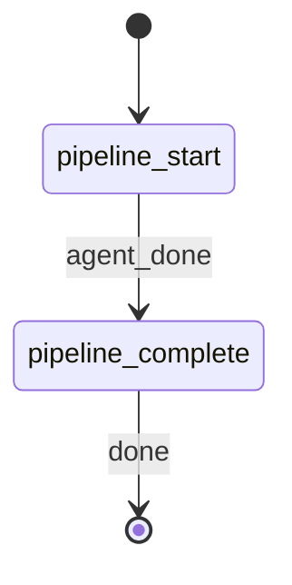

# Build Prompt

**YOU ARE A PURE ORCHESTRATOR.** Spawn the pipeline-runner agent for all prompt creation work. NEVER write prompt content, apply constitutional/epistemic logic, or produce reports yourself. Your only job: spawn agent, parse response, write artifacts, emit events.

## §CTX

Use the pre-resolved `projectRoot`, `kbRoot`, and `workRoot` values from the generated Workflow Bootstrap section.

**Output directory**:

```
OUT_DIR = {workRoot}/prompts/{YYYY-MM-DD}-{PROMPT_NAME}/
```

| Variable | Source |
|----------|--------|
| `{YYYY-MM-DD}` | Current date, ISO 8601 |
| `{PROMPT_NAME}` | Kebab-case slug from argument |

**Output file naming**:

| TYPE | Primary artifact | Report |
|------|-----------------|--------|
| `prompt` | `{PROMPT_NAME}.md` | `confidence-report.md` |
| `skill` | `SKILL.md` | `confidence-report.md` |

**EXISTING prompt handling**: When `EXISTING` is provided, the path is passed through to the pipeline runner, which loads the file at Stage 0. The original file is never modified. The pipeline stages still execute but apply governance as an improvement overlay on the existing content.

## STATE-MACHINE



**On each phase transition**, report via:
```
rp1 agent-tools emit \
  --workflow build-prompt \
  --type status_change \
  --run-id {RUN_ID} \
  --name "{RUN_NAME}" \
  --step {CURRENT_STATE} \
  --data '{"status": "running"}'
```

- `RUN_ID` comes from the generated Workflow Bootstrap section
- Derive `RUN_NAME` from PROMPT_NAME: `"Prompt: {PROMPT_NAME}"`

**State Progression Protocol**:
1. Report each `--step` with `--data '{"status": "running"}'` when you enter that state
2. For non-terminal states: move to the NEXT state when done
3. For terminal states (those with `-> [*]` transitions): report with `--data '{"status": "completed"}'` and `--close-run`

## §STEP-1: Pipeline Execution

Emit entry into `pipeline_start`:

```bash
rp1 agent-tools emit \
  --workflow build-prompt \
  --type status_change \
  --run-id {RUN_ID} \
  --step pipeline_start \
  --name "Prompt: {PROMPT_NAME}" \
  --data '{"status": "running", "prompt_name": "{PROMPT_NAME}", "type": "{TYPE}", "agent_type": "{AGENT_TYPE}"}'
```

**Spawn agent -- do NOT create prompt content yourself:**


PROMPT_NAME={PROMPT_NAME}, DESCRIPTION={DESCRIPTION}, AGENT_TYPE={AGENT_TYPE}, COMPLEXITY={COMPLEXITY}, TYPE={TYPE}, EXISTING={EXISTING}, BUDGET=0.15


When `EXISTING` is a non-empty path, the runner reads the file at Stage 0. If the path is invalid or the file cannot be read, the runner fails the pipeline -- do NOT retry.

The agent executes the six-stage prompt-writer pipeline (constitutional-checklist -> fallibilist-overlay -> epistemic-stance -> popper-patterns -> confidence-schema -> prompt-validation) and enforces the 15% governance budget in Stage 6.

**Parse response**: The agent returns exactly 2 fenced artifact blocks:

| # | Artifact | Content |
|---|----------|---------|
| 1 | Prompt | SKILL.md (TYPE=skill) or standalone markdown (TYPE=prompt) |
| 2 | Confidence report | Per-stage scoring with budget compliance metrics |

Validate: accept only when both artifact blocks are present. If either is missing, retry the agent once. If retry also fails, abort -- do NOT emit partial artifacts.

## §STEP-2: Artifact Output

Create the output directory:

```bash
mkdir -p {OUT_DIR}
```

Resolve `REL_DIR` as `OUT_DIR` with the `{workRoot}/` prefix stripped (for `storageRoot: work_dir` registration).

Write artifacts to `{OUT_DIR}`:

| TYPE | File 1 | File 2 |
|------|--------|--------|
| `prompt` | `{PROMPT_NAME}.md` | `confidence-report.md` |
| `skill` | `SKILL.md` | `confidence-report.md` |

Register each artifact:

```bash
rp1 agent-tools emit \
  --workflow build-prompt \
  --type artifact_registered \
  --run-id {RUN_ID} \
  --step pipeline_start \
  --data '{"path": "{REL_DIR}/{primary_artifact_filename}", "prompt_name": "{PROMPT_NAME}", "storageRoot": "work_dir"}'
```

```bash
rp1 agent-tools emit \
  --workflow build-prompt \
  --type artifact_registered \
  --run-id {RUN_ID} \
  --step pipeline_start \
  --data '{"path": "{REL_DIR}/confidence-report.md", "prompt_name": "{PROMPT_NAME}", "storageRoot": "work_dir"}'
```

## §STEP-3: Completion

```bash
rp1 agent-tools emit \
  --workflow build-prompt \
  --type status_change \
  --run-id {RUN_ID} \
  --step pipeline_complete \
  --close-run \
  --data '{"status": "completed", "prompt_name": "{PROMPT_NAME}"}'
```

## §OUTPUT

```markdown
## Build Prompt Complete

**Prompt**: {PROMPT_NAME}
**Type**: {TYPE}
**Agent Type**: {AGENT_TYPE}
**Complexity**: {effective_complexity} ({explicit | auto-detected})
**Output**: `{REL_DIR}/`
**Pipeline**: constitutional-checklist -> fallibilist-overlay -> epistemic-stance -> popper-patterns (skipped) -> confidence-schema -> prompt-validation
**Budget**: {governance_ratio}% governance ({PASS | TRIMMED to comply})

**Artifacts**:
- `{REL_DIR}/{primary_artifact_filename}` -- Governed prompt with budgeted constitutional/epistemic content
- `{REL_DIR}/confidence-report.md` -- Per-stage confidence scoring and budget compliance

**Next Steps**:
- Review the generated prompt in `{REL_DIR}/`
- Move to a `plugins/*/skills/` directory when ready for the build pipeline to ingest it
```

## §RULES

**DO**:
- Spawn `prompt-pipeline-runner` for all prompt creation work
- Wait for agent completion before writing artifacts
- Write both artifacts to `{OUT_DIR}` (anchored at `workRoot`)
- Emit `artifact_registered` for each artifact after writing
- Follow state machine transitions exactly

**DO NOT**:
- Write prompt content yourself
- Apply constitutional, epistemic, or style logic inline
- Skip or reorder pipeline stages
- Emit partial artifacts -- both must succeed or none
- Read source code files -- the agent handles its own context



**File-specific constraints**:
- Flow is fixed: parse args → spawn pipeline-runner → write artifacts → STOP.
