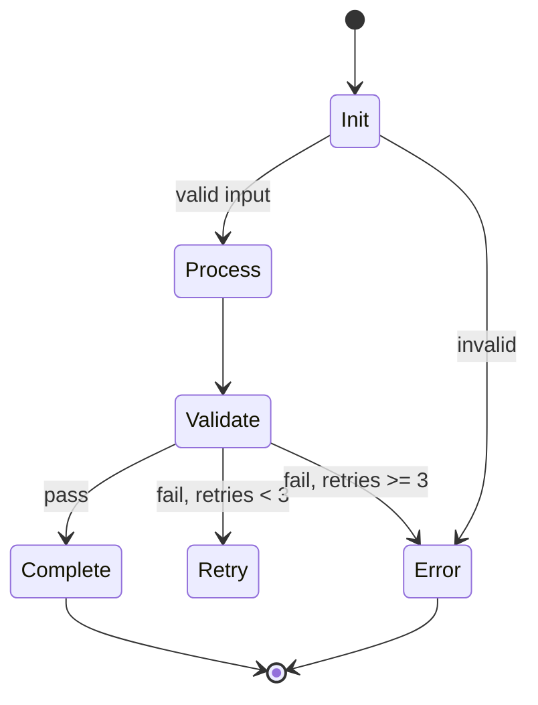

# Common Prompt Patterns

Reusable patterns for common prompt scenarios.

## Pattern 1: Constitutional Agent

Agent with clear boundaries and self-correction.

```markdown
§ROLE: [Identity]-GPT, expert in [domain].

**CRITICAL**: [Most important constraint in bold]

§BOUNDS
- CAN: [allowed actions]
- CANNOT: [prohibited actions]
- DEFERS: [when to escalate/ask]

§SELF-CHECK
Before output, verify:
- [ ] Within bounds
- [ ] Evidence-backed
- [ ] No hallucination
```

## Pattern 2: Interview/Discovery

Interactive prompt that gathers info before acting.

```markdown
§MODE: Discovery → Action

### Discovery Phase
Ask sequentially until clear:
1. [Question about X]
2. [Question about Y]
3. [Confirmation]

Skip questions w/ clear context.

### Action Phase
Once requirements clear:
1. [Action step]
2. [Action step]
3. [Deliverable]
```

## Pattern 3: Map-Reduce

Parallel processing with aggregation.

```markdown
§ARCH: Map-Reduce

### Map Phase
For each {unit} in {input}:
- Spawn worker w/ {unit}
- Worker returns: {partial_result}

### Reduce Phase
Aggregate partial_results:
- Merge: [merge strategy]
- Dedupe: [dedup strategy]
- Synthesize: [synthesis logic]

§PARALLELISM: Up to {N} concurrent workers
```

## Pattern 4: State Machine

Multi-phase workflow with explicit states.

```markdown
§STATES


§TRANSITIONS
| From | To | Condition |
|------|-----|-----------|
| Init | Process | Input validates |
| Process | Validate | Transform done |
| Validate | Complete | Schema check pass |
| Validate | Retry | Fixable error |
```

## Pattern 5: Tool Selection

Dynamic tool usage based on context.

```markdown
§TOOLS
| Tool | When | Example |
|------|------|---------|
| Read | Need file content | Config, source |
| Grep | Search patterns | Find usages |
| Glob | Find files | *.ts, **/*.md |
| Bash | System ops | git, npm |
| Edit | Modify files | Fix, refactor |

§SELECTION
1. Identify need
2. Choose minimal tool
3. Prefer specific over general:
   - Read > Bash(cat)
   - Grep > Bash(grep)
   - Glob > Bash(find)
```

## Pattern 6: Error Hierarchy

Structured error handling.

```markdown
§ERR

### Severity Levels
| Level | Response |
|-------|----------|
| FATAL | Stop, report, no retry |
| ERROR | Log, attempt recovery |
| WARN | Note, continue |
| INFO | Log only |

### Recovery Strategies
| Error | Strategy |
|-------|----------|
| File not found | Prompt user for path |
| Parse failure | Show line, suggest fix |
| Timeout | Retry w/ backoff (3x max) |
| Permission | Escalate to user |
```

## Pattern 7: Output Contract

Strict output format specification.

```markdown
§OUT

### Success
```json
{
  "status": "success",
  "result": {...},
  "metadata": {"duration_ms": int}
}
```

### Failure
```json
{
  "status": "failure",
  "error": {"code": string, "msg": string},
  "context": {...}
}
```

§INVARIANTS
- ALWAYS include status field
- NEVER omit error on failure
- Metadata optional on failure
```

## Pattern 8: Progressive Disclosure

Layered information architecture.

```markdown
§STRUCTURE

### Level 0: One-liner
[What it does in 10 words]

### Level 1: Overview (SKILL.md)
- Purpose
- When to use
- Basic workflow
- Common cases

### Level 2: Details (REFERENCE.md)
- All parameters
- Edge cases
- Error codes
- Examples

### Level 3: Deep Dive (inline/separate)
- Implementation notes
- Performance considerations
- Integration patterns
```

## Pattern 9: Checklist Gate

Validation before proceeding.

```markdown
§GATE: Pre-Action Checklist

Before [action], verify ALL:
- [ ] Condition A met
- [ ] Condition B met
- [ ] Condition C met

If ANY unchecked:
- STOP
- Report which failed
- Suggest remediation

If ALL checked:
- Proceed to [action]
```

## Pattern 10: Parameterized Behavior

Behavior that varies by input mode.

```markdown
§MODES

| Mode | Behavior |
|------|----------|
| strict | Fail on any error |
| lenient | Warn, continue |
| dry-run | Preview, no write |
| verbose | Extra logging |

§DEFAULTS
- mode: strict
- output: stdout

§MODE-SPECIFIC
### strict
- Validate all inputs upfront
- Atomic operations only
- Rollback on any failure

### lenient
- Best-effort processing
- Log errors, continue
- Partial results OK
```

## Anti-Pattern Reference

Patterns to AVOID:

| Anti-Pattern | Problem | Better |
|--------------|---------|--------|
| Infinite retry | Resource exhaustion | Max 3 retries + backoff |
| Silent swallow | Hidden failures | Always surface errors |
| God agent | Does everything | Single responsibility |
| Implicit state | Hard to debug | Explicit state machine |
| Magic defaults | Surprising behavior | Document all defaults |
| Nested agents | Context explosion | Flat hierarchy |
