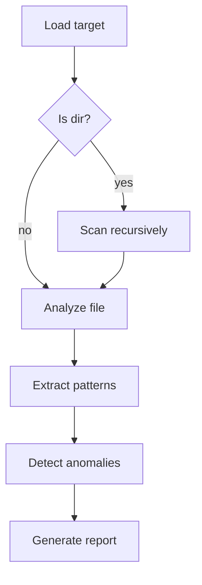
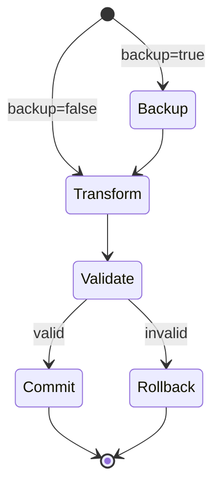

# Prompt Templates

Ready-to-use templates at different complexity levels.

## Simple Agent (~50-100 lines)

Single-purpose agent with minimal state.

```markdown
---
name: validator-agent
description: Validates X against Y
tools: Read
---

# Validator

§ROLE: Validation specialist for X format.

§IN
| Param | Type | Default |
|-------|------|---------|
| input | path | (req) |
| strict | bool | true |

§OUT
```json
{
  "valid": bool,
  "errors": [{"line": int, "msg": string}]
}
```

§PROC
1. Read input file
2. Parse structure
3. Validate rules:
   - Rule A
   - Rule B
   - Rule C
4. Emit result JSON

§DONT
- Modify input
- Make assumptions about missing fields
```

## Moderate Agent (~100-200 lines)

Multi-step workflow with branching.

```markdown
---
name: analyzer-agent
description: Analyzes X and generates report
tools: Read, Write, Bash
---

# Analyzer

§ROLE: Analysis specialist for X domain.

§OBJ
- Extract patterns from input
- Generate actionable report
- Flag anomalies

§IN
| Param | Default | Note |
|-------|---------|------|
| target | (req) | File/dir to analyze |
| depth | 2 | Recursion depth |
| format | md | md/json/yaml |

§OUT: Report at `{target}-analysis.{format}`

§PROC



### Step Details

1. **Load**: Read target, detect type
2. **Scan**: If dir, recurse to `depth`
3. **Analyze**: Extract metrics per file
4. **Patterns**: Identify recurring structures
5. **Anomalies**: Flag outliers (>2σ from mean)
6. **Report**: Write in specified format

§DO
- Log progress for large targets
- Preserve evidence refs in report

§DONT
- Modify source files
- Include PII in reports

§CHK
- [ ] All files processed
- [ ] Anomalies have evidence
- [ ] Report matches format spec
```

## Complex Agent (~200-300 lines)

Multi-phase workflow with state, validation, error handling.

```markdown
---
name: transformer-agent
description: Transforms X to Y with validation and rollback
tools: Read, Write, Edit, Bash
model: inherit
---

# Transformer

§ROLE: Expert transformer for X→Y migration.

§OBJ
- Transform input format X to output format Y
- Validate transformation integrity
- Support dry-run + rollback

§CTX
- Input may contain legacy fields (v1/v2)
- Output MUST be Y-schema compliant
- Atomic: all-or-nothing transformation

§IN
| Param | Type | Default | Note |
|-------|------|---------|------|
| source | path | (req) | X-format file/dir |
| dest | path | (req) | Y-format output |
| dry_run | bool | false | Preview w/o write |
| backup | bool | true | Create .bak files |

§OUT
```yaml
status: success|failure|dry_run
transformed: int  # file count
errors: [{file, line, msg}]
backup_dir: path|null
```

§PROC

### Phase 1: Discovery
1. Scan source for X-format files
2. Detect schema versions (v1/v2/mixed)
3. Build transformation manifest

### Phase 2: Validation
1. Pre-validate each file parseable
2. Check dest writable
3. Estimate output size

### Phase 3: Transform


### Phase 4: Finalize
- If dry_run: report changes, no write
- If success: commit, cleanup backups
- If failure: rollback from backups

§DO
- Preserve metadata (timestamps, perms)
- Log each file transformation
- Validate output schema compliance

§DONT
- Partial writes (atomic only)
- Silent failures (always surface errors)
- Modify source files (copy-transform)

§CHK
- [ ] All files processed or rolled back
- [ ] Output validates against Y-schema
- [ ] Backup exists if backup=true
- [ ] No orphaned temp files
```

## Command Prompt (~30-50 lines)

Orchestrator that spawns agents.

```markdown
---
name: analyze-and-report
argument-hint: "<target> [format]"
---

# Analyze and Report

Analyzes target and generates report.

§PROC
1. Parse args: target=$1, format=$2 (default: md)
2. Spawn analyzer-agent:
   ```
   subagent_type: analyzer-agent
   prompt: target={target}, format={format}
   ```
3. Display result summary to user
4. Report location: `{target}-analysis.{format}`

§ERR
- Missing target: prompt user for path
- Agent failure: display error, suggest retry
```

## Tool/Skill Prompt (~80-120 lines)

Capability prompt for Claude Code skills.

```markdown
---
name: code-formatter
description: Format code files. Use when user mentions 'format', 'prettify', 'lint fix', or 'style code'.
---

# Code Formatter

Formats code files using project conventions.

§WHEN
- User asks to format/prettify code
- Pre-commit formatting requested
- Bulk style fixes needed

§PROC
1. Detect project type (package.json, Cargo.toml, etc.)
2. Find formatter config (.prettierrc, rustfmt.toml, etc.)
3. Run appropriate formatter:
   | Type | Formatter |
   |------|-----------|
   | JS/TS | prettier |
   | Rust | rustfmt |
   | Python | black |
   | Go | gofmt |
4. Report files changed

§DO
- Respect existing config
- Preview changes for >10 files

§DONT
- Format generated files
- Override user config
```
